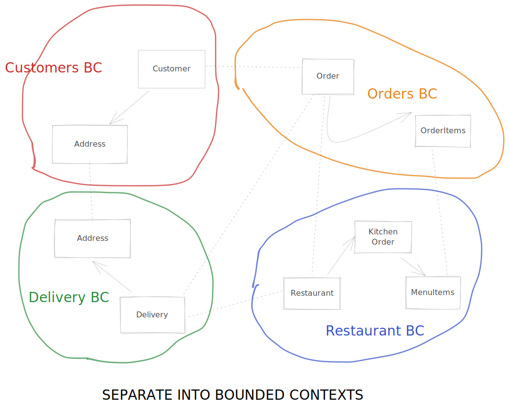

# ZenWave Code Generator

> :warning: Work in progress and not ready for use.

ZenWave Code Generator is a configurable and extensible code generator tool for **Domain Driven Design (DDD)** and **API-First** that can generate code from a mix of different models including:

- JHipster Domain Language (JDL)
- AsyncAPI
- OpenAPI

The main idea is describe your domain core model using the JHipster Domain Language (as ubiquitous language) and API-First specs like AsyncAPI and OpenAPI to describe Inter Process Comunications (IPC)

**Note:** Official provided code generator plugins are designed to generate functional code and tests on top of existing projects. Creating a base project is out of scope but you can use http://start.spring.io or https://start.jhipster.tech/, in case your company doesn't already have a project starter or archetype.

TOC:

- [ZenWave Code Generator](#zenwave-code-generator)
- [Choose your personal journey:](#choose-your-personal-journey)
  - [Designing a system from scratch with DDD and API-First](#designing-a-system-from-scratch-with-ddd-and-api-first)
    - [From idea to JDL](#from-idea-to-jdl)
    - [Designing Inter Process Comunication with API-First](#designing-inter-process-comunication-with-api-first)
      - [Sagas](#sagas)
      - [CQRS](#cqrs)
  - [Refactoring a legacy monolith](#refactoring-a-legacy-monolith)
    - [Reverse engineering JDL from Java classes (JPA and MongoDB)](#reverse-engineering-jdl-from-java-classes-jpa-and-mongodb)
  - [Adding functionality on top of an existent microservices archytecture](#adding-functionality-on-top-of-an-existent-microservices-archytecture)
    - [Reverse engineering JDL from Java classes (JPA and MongoDB)](#reverse-engineering-jdl-from-java-classes-jpa-and-mongodb-1)
    - [Reverse engineering JDL from OpenAPI definition schemas](#reverse-engineering-jdl-from-openapi-definition-schemas)
  - [Generating functional and testing code: What can we generate for you today?](#generating-functional-and-testing-code-what-can-we-generate-for-you-today)
    - [JDL Server Entities (WIP)](#jdl-server-entities-wip)

# Choose your personal journey:

Whether you are desiging a system from scratch, refactoring an existing legacy monolith or just adding functionality on top of existing microservices architecture, choose your own your DDD+Api-First journey with ZenWave Code Generator.

The main idea is describe your domain core model using the JHipster Domain Language (JDL as ubiquitous language) and API-First specs like AsyncAPI and OpenAPI to describe Inter Process Comunications (IPC)

## Designing a system from scratch with DDD and API-First

### From idea to JDL

- Domain Map: First sketch your full domain model:


- Domain Subdomains: Now decompouse your model into manageable subdomains:


- Domain Bounded Contexts: Now you need to separate your subdomains as separated bounded contexts



- Define Agreggates in Bounded Contexts: Now you can describre your aggregate roots and their composing entities into separate JDL files

[DDD-Agreggates-BoundedContexts.jdl](04-DDD-Agreggates-BoundedContexts.jdl)


### Designing Inter Process Comunication with API-First

#### Sagas


#### CQRS

TODO

## Refactoring a legacy monolith

### Reverse engineering JDL from Java classes (JPA and MongoDB)

If starting with legacy project, you can reverse engineer JDL from Java entity classes. JPA and MongoDB are supported.

It requires access to your project classpath so you can just paste the following code on any test class or main method:

```java
String jdl = new JavaToJDLGenerator()
    .withPackageName("io.zenwave360.generator.jpa2jdl")
    .withPersistenceType(JavaToJDLGenerator.PersistenceType.JPA)
    .generate();
System.out.println(jdl);
```

```java
String jdl = new JavaToJDLGenerator()
    .withPackageName("io.zenwave360.generator.mongodb2jdl")
    .withPersistenceType(JavaToJDLGenerator.PersistenceType.MONGODB)
    .generate();
System.out.println(jdl);
```

## Adding functionality on top of an existent microservices archytecture

### Reverse engineering JDL from Java classes (JPA and MongoDB)

When your domain java code evolves you may want to regenerate entities back from java code, see: [Reverse engineering JDL from Java classes (JPA and MongoDB)](#reverse-engineering-jdl-from-java-classes-jpa-and-mongodb)

### Reverse engineering JDL from OpenAPI definition schemas

Reverse engineer JDL entities from OpenAPI schemas:

```shell
jbang zw -p io.zenwave360.generator.plugins.OpenAPIToJDLConfigurationPreset \
    specFile=openapi.yml targetFolder=target/out targetFile=entities.jdl
cat target/out/entities.jdl
```

## Generating functional and testing code: What can we generate for you today?


### JDL Server Entities (WIP)

Aims to generate a complete Architecture based on Domain models expressed in JDL.

```shell
jbang zw -p io.zenwave360.generator.plugins.JDLEntitiesConfigurationPreset \
    specFile=entities-model.jdl targetFolder=target/out
```
