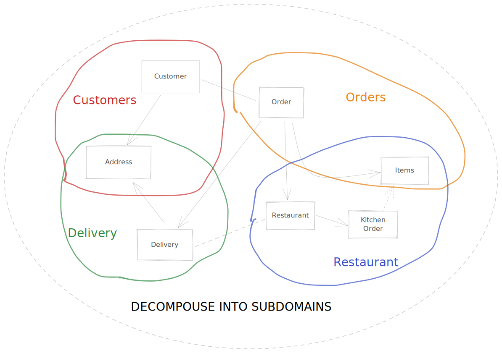

> :warning: Work in progress and not ready for use.

ZenWave Code Generator is a configurable and extensible code generator tool for **Domain Driven Design (DDD)** and **API-First** that can generate code from a mix of different models including:

- JHipster Domain Language (JDL)
- AsyncAPI
- OpenAPI

The main idea is describe your domain core model using the JHipster Domain Language (as ubiquitous language) and API-First specs like AsyncAPI and OpenAPI to describe Inter Process Comunications (IPC)

**Note:** Official provided code generator plugins are designed to generate functional code and tests on top of existing projects. Creating a base project is out of scope but you can use http://start.spring.io or https://start.jhipster.tech/, in case your company doesn't already have a project starter or archetype.

- [Choose your personal journey:](#choose-your-personal-journey)
  - [Designing a system from scratch with DDD and API-First](#designing-a-system-from-scratch-with-ddd-and-api-first)
    - [From idea to JDL](#from-idea-to-jdl)
    - [Designing Inter Process Communication with API-First](#designing-inter-process-communication-with-api-first)
      - [Access data from other bounded contexts: Direct Access and CQRS](#access-data-from-other-bounded-contexts-direct-access-and-cqrs)
      - [Sagas](#sagas)
  - [Refactoring a legacy monolith](#refactoring-a-legacy-monolith)
    - [Reverse engineering JDL from Java classes (JPA and MongoDB)](#reverse-engineering-jdl-from-java-classes-jpa-and-mongodb)
  - [Adding functionality on top of an existent microservices archytecture](#adding-functionality-on-top-of-an-existent-microservices-archytecture)
    - [Reverse engineering JDL from Java classes (JPA and MongoDB)](#reverse-engineering-jdl-from-java-classes-jpa-and-mongodb-1)
    - [Reverse engineering JDL from OpenAPI definition schemas](#reverse-engineering-jdl-from-openapi-definition-schemas)
  - [Generating functional and testing code: What can we generate for you today?](#generating-functional-and-testing-code-what-can-we-generate-for-you-today)
    - [JDL Server Entities (WIP)](#jdl-server-entities-wip)

# Choose your personal journey:

Whether you are designing a system from scratch, refactoring an existing legacy monolith or just adding functionality on top of existing microservices' architecture, choose your own your DDD+Api-First journey with ZenWave Code Generator.

We are going to use an hypothetical **Online Food Delivery Service** system.

The main idea is:

- To describe your domain core model using the JHipster Domain Language (JDL as ubiquitous language) and
- API-First specs like AsyncAPI and OpenAPI to describe Inter Process Communications (IPC) between bounded contexts/microservices.
- Use ZenWave Code Generator to generate (_a lot of_) infrastructure, functional and testing code from your models.

## Designing a system from scratch with DDD and API-First

### From idea to JDL

- **Domain Map:** First sketch your full domain model:


- **Domain Subdomains:** Now decompouse your model into manageable subdomains:



- **Domain Bounded Contexts:** Now you need to separate your subdomains as separated bounded contexts


- **Define Aggregates and Entities in your Bounded Contexts:** Now you can describe your aggregate roots and their composing entities into separate JDL files

<details>
  <summary>Orders Bounded Context JDL</summary>

```
//==========================================================
// Orders BC
//==========================================================

/**
 * The Order entity.
 */
 @AggregateRoot
entity Order {
    state OrderState /** state */
    customerId String /** customerId */
    // orderLines OrderLineItem /** orderLines */
    // paymentInfo OrderPaymentInfo
    // deliveryInfo OrderDeliveryInfo
}

enum OrderState {
    CREATED, CONFIRMED, CANCELLED
}

entity OrderLineItem {
    menuItemId Integer
    quantity Integer
}

/**
 * The OrderPaymentInfo entity.
 */
entity OrderPaymentInfo {
    creditCardId String
}

/**
 * The OrderDeliveryInfo entity.
 */
entity OrderDeliveryInfo {
    addressId String
}

relationship OneToMany {
    Order to OrderLineItem
}

relationship OneToOne {
	Order to OrderPaymentInfo
    Order to OrderDeliveryInfo
}
```

</details>

<details>
  <summary>Restaurants Bounded Context JDL</summary>

```
//==========================================================
// Restaurants BC
//==========================================================

/**
 * The Restaurant entity.
 */
@AggregateRoot
entity Restaurant {
    name String
}

entity MenuItem {
    name String
    price Integer
}

entity RestaurantAddress {
    address String
}

entity RestaurantOrder {
	orderId String
    status RestaurantOrderStatus
}

enum RestaurantOrderStatus {
    ACCEPTED, READY, DELIVERED
}

relationship OneToMany {
	Restaurant to MenuItem
}

relationship OneToOne {
	Restaurant to RestaurantAddress
}

relationship ManyToOne {
	Restaurant to RestaurantOrder
}
```

</details>

<details>
  <summary>Delivery Bounded Context JDL</summary>

```
//==========================================================
// Delivery BC
//==========================================================
entity DeliveryOrder {
    orderId String
    status DeliveryOrderStatus
}

enum DeliveryOrderStatus {
    ACCEPTED, ONTRANSIT, DELIVERED
}
```

</details>

<details>
  <summary>Customers Bounded Context JDL</summary>

```
//==========================================================
// Customers BC
//==========================================================

/**
 * The Customer entity.
 */
@AggregateRoot
entity Customer {
    fullName String /** fullName */
}

entity CustomerAddress {}

entity CreditCard {
    cardNumber String
}

relationship OneToMany {
	Customer to CustomerAddress
    Customer to CreditCard
}

```

</details>


### Designing Inter Process Communication with API-First

When you separate your domain model into subdomains and bounded context, bounded contexts become a natural boundary to split your system into separate services and microservices you need to define a way to:

- Access data from other bounded contexts
- Coordinate inter process communications

#### Access data from other bounded contexts: Direct Access and CQRS

To share data between loosely coupled services is a good idea to:

- Publish read access your @RootAggregates as request-response services like a REST API.
- Publish events of @RootAggregates changes (Create, Update, Delete) to a shared event broker as a publish-subscribe services.

This is commonly enough for other services to implement either direct synchronous access or create CQRS views.

Also APIs do evolve. By their synchronous nature REST APIs, if up to date, clients and services should be compatible with each other. But event messages depending on the event broker retention policy may live indefinitely and that complicates consumers implementation as they may need to know how to process different evolving message formats.

An easy way to simplify consumers implementation, regarding evolving message formats:

- Just publish the aggregate ID and the event type (Create, Update, Delete) to the event broker.
- Let the consumers use the REST API to fetch data synchronously.


#### Sagas

Currently, you can use AsyncAPI 2 specification to describe message schemas and the channels they are written to but is not enough to describe the inter process communication between services like SAGAs but [ongoing work for version 3](https://github.com/asyncapi/spec/issues/618) is very promissing regarding documenting IPCs like SAGAs and CQRS.

With new upcoming version of AsyncAPI 3, you can separate how you describe on separate files:

- Channels, messages and servers
- Applications connected to those channels

<details>
  <summary>Food Delivery Service Order's Saga Asyncapi.yml example</summary>

```yaml
asyncapi: 3.0.0

info:
  title: Food Delivery Service Order's Saga
  version: 0.1.0

components:
  servers:

  channels:
    ordersSagaCommonChannel:
      address: orders/saga
      message:
        oneOf:
          - $ref: "#/components/messages/onOrderCreated"
          - $ref: "#/components/messages/onOrderAcceptedAtRestaurant"
          - $ref: "#/components/messages/onOrderReadyForPickup"
          - $ref: "#/components/messages/onOrderAcceptedAtDelivery"
          - $ref: "#/components/messages/onOrderPickedUp"
          - $ref: "#/components/messages/onOrderDeliveryStatusUpdated"
          - $ref: "#/components/messages/onOrderDelivered"
```

</details>

<details>
  <summary>Applications connected to those channels: Restaurant Service Asyncapi.yml example</summary>

```yaml
asyncapi: 3.0.0

info:
  title: Website Backend
  version: 1.0.0

servers:
  kafka:
    $ref: "orders.saga.asyncapi.yaml#/components/servers/kafka"

channels:
  ordersSagaCommonChannel:
    $ref: "orders.saga.asyncapi.yaml#/components/channels/ordersSagaCommonChannel"

# Notice how each operation specifies/overrides which message/s is interested in
operations:
  onOrderCreated:
    description: Join the orders saga.
    action: receive
    channel: ordersSagaCommonChannel
    message:
      $ref: "orders.saga.asyncapi.yaml#/components/messages/onOrderCreated"
  onOrderAcceptedAtRestaurant:
    description: Restaurant informs is committed to prepare the order.
    action: send
    channel: ordersSagaCommonChannel
    message:
      $ref: "orders.saga.asyncapi.yaml#/components/messages/onOrderAcceptedAtRestaurant"
  onOrderReadyForPickup:
    description: Restaurant informs order is ready to pick up.
    action: send
    channel: ordersSagaCommonChannel
    message:
      $ref: "orders.saga.asyncapi.yaml#/components/messages/onOrderReadyForPickup"
```

</details>


## Refactoring a legacy monolith

### Reverse engineering JDL from Java classes (JPA and MongoDB)

If starting with legacy project, you can reverse engineer JDL from Java entity classes. JPA and MongoDB are supported.

It requires access to your project classpath so you can just paste the following code on any test class or main method:

```java
String jdl = new JavaToJDLGenerator()
    .withPackageName("io.zenwave360.generator.jpa2jdl")
    .withPersistenceType(JavaToJDLGenerator.PersistenceType.JPA)
    .generate();
System.out.println(jdl);
```

```java
String jdl = new JavaToJDLGenerator()
    .withPackageName("io.zenwave360.generator.mongodb2jdl")
    .withPersistenceType(JavaToJDLGenerator.PersistenceType.MONGODB)
    .generate();
System.out.println(jdl);
```

## Adding functionality on top of an existent microservices archytecture

### Reverse engineering JDL from Java classes (JPA and MongoDB)

When your domain java code evolves you may want to regenerate entities back from java code, see: [Reverse engineering JDL from Java classes (JPA and MongoDB)](#reverse-engineering-jdl-from-java-classes-jpa-and-mongodb)

### Reverse engineering JDL from OpenAPI definition schemas

Reverse engineer JDL entities from OpenAPI schemas:

```shell
jbang zw -p io.zenwave360.generator.plugins.OpenAPIToJDLConfigurationPreset \
    specFile=openapi.yml targetFolder=target/out targetFile=entities.jdl
cat target/out/entities.jdl
```

## Generating functional and testing code: What can we generate for you today?


### JDL Server Entities (WIP)

Aims to generate a complete Architecture based on Domain models expressed in JDL.

```shell
jbang zw -p io.zenwave360.generator.plugins.JDLEntitiesConfigurationPreset \
    specFile=entities-model.jdl targetFolder=target/out
```
