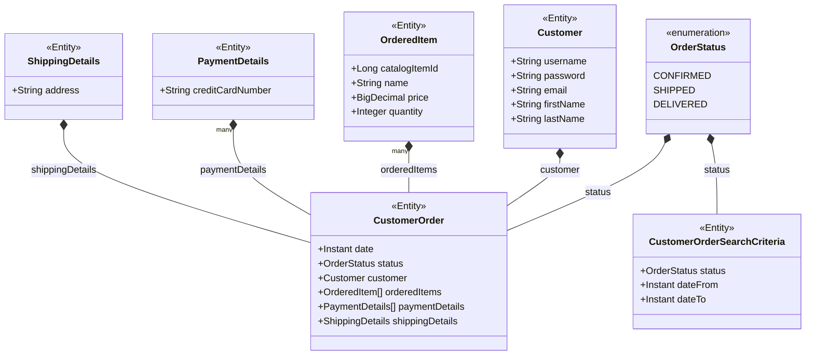

# Orders Model

```mermaid
classDiagram

class Customer {
  <<Entity>>
  +String username
  +String password
  +String email
  +String firstName
  +String lastName
}

class CustomerOrder {
  <<Entity>>
  +Instant date
  +OrderStatus status
  +Customer customer
  +OrderedItem[] orderedItems
  +PaymentDetails[] paymentDetails
  +ShippingDetails shippingDetails
}
OrderStatus  *-- CustomerOrder: status
Customer  *-- CustomerOrder: customer
OrderedItem "many" *-- CustomerOrder: orderedItems
PaymentDetails "many" *-- CustomerOrder: paymentDetails
ShippingDetails  *-- CustomerOrder: shippingDetails

class CustomerOrderSearchCriteria {
  <<Entity>>
  +OrderStatus status
  +Instant dateFrom
  +Instant dateTo
}
OrderStatus  *-- CustomerOrderSearchCriteria: status

class OrderedItem {
  <<Entity>>
  +Long catalogItemId
  +String name
  +BigDecimal price
  +Integer quantity
}

class PaymentDetails {
  <<Entity>>
  +String creditCardNumber
}

class ShippingDetails {
  <<Entity>>
  +String address
}


class OrderStatus {
  <<enumeration>>
  CONFIRMED
  SHIPPED
  DELIVERED
}
```
