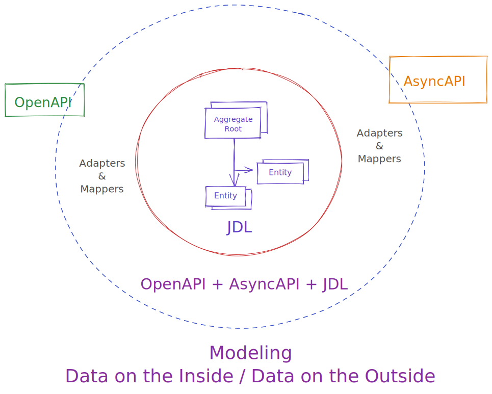
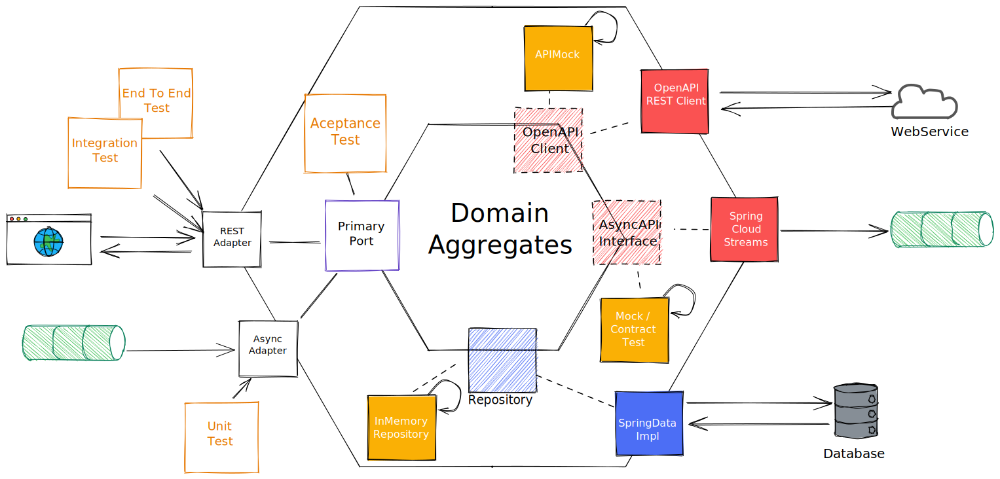
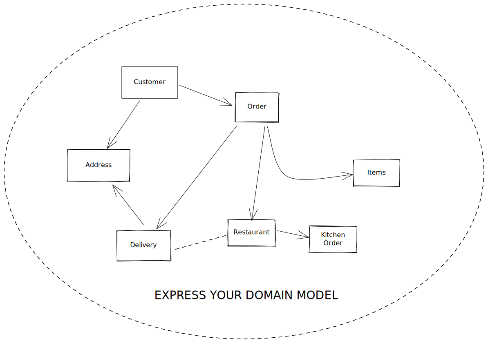
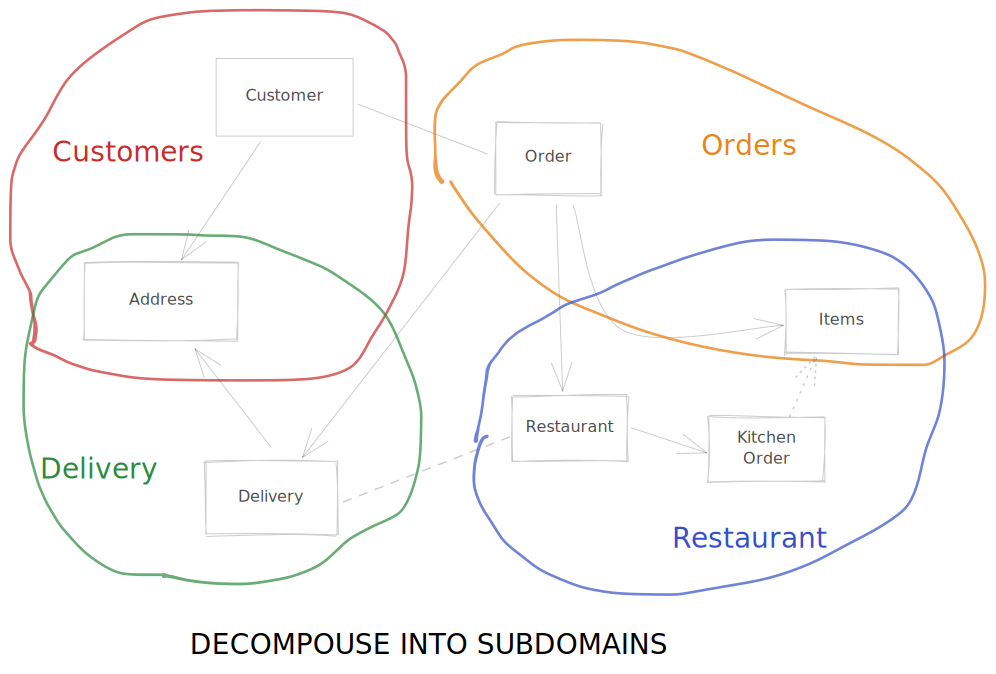
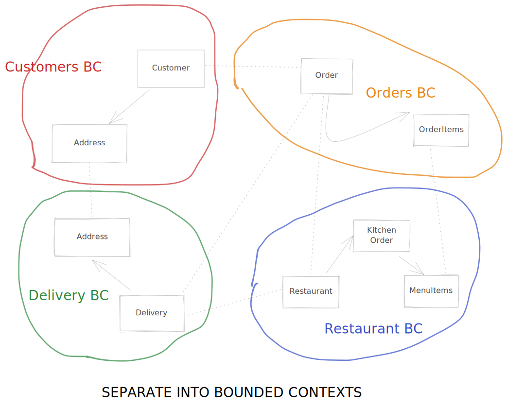
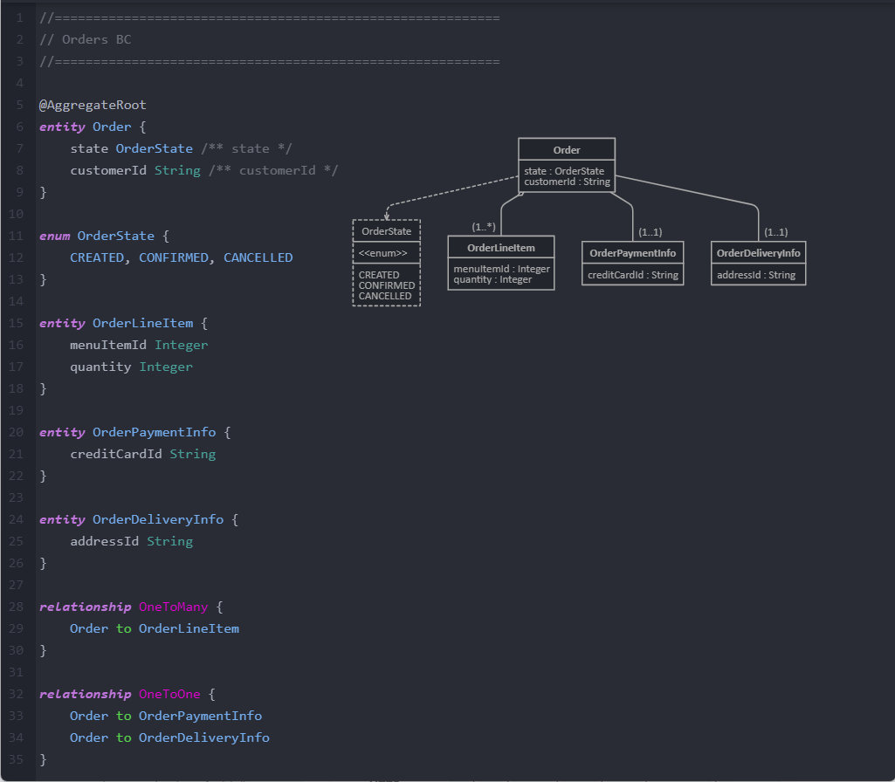
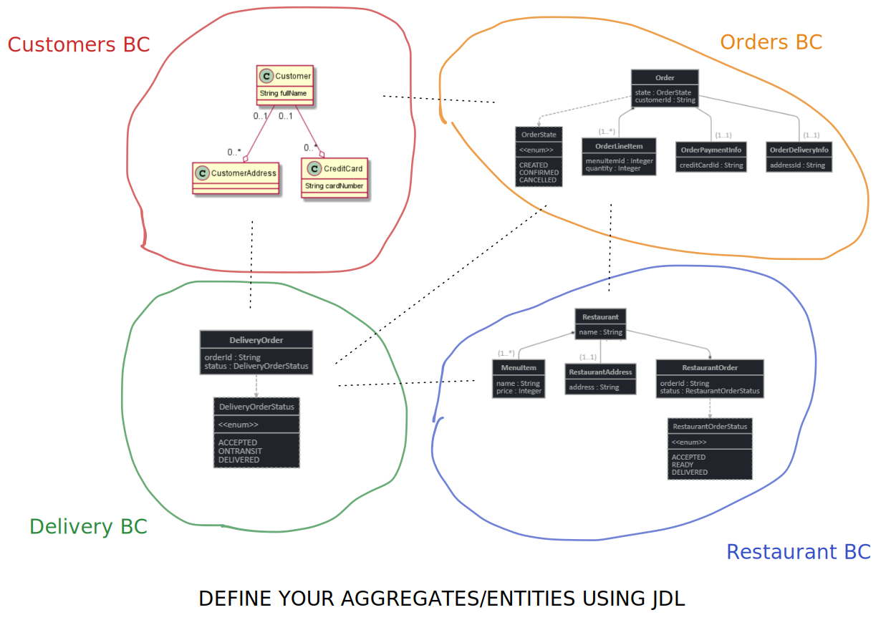
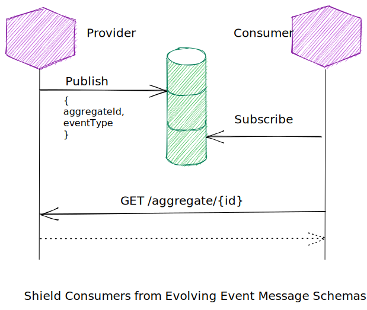
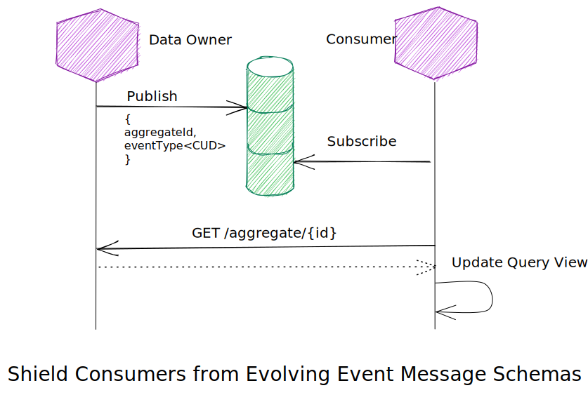

# ZenWave Code Generator

> :warning: Work in progress.

[](https://search.maven.org/artifact/io.github.zenwave360/zenwave-code-generator)
[](https://github.com/ZenWave360/zenwave-code-generator/releases)

[](https://github.com/ZenWave360/zenwave-code-generator/actions/workflows/build.yml)
[](https://github.com/ZenWave360/zenwave-code-generator/actions/workflows/build.yml)
[](https://github.com/ZenWave360/zenwave-code-generator/actions/workflows/build.yml)
[](https://github.com/ZenWave360/zenwave-code-generator/blob/main/LICENSE)

ZenWave Code Generator is a configurable and extensible code generator tool for **Domain Driven Design (DDD)** and **API-First** that can generate code from a mix of different models including:

- [JHipster Domain Language (JDL)](https://www.jhipster.tech/jdl/intro)
- [AsyncAPI](https://www.asyncapi.com/docs/getting-started/coming-from-openapi)
- [OpenAPI](https://swagger.io/specification/)

Using JHipster Domain Language as **Ubiquitous Language** for [Data on the Inside](https://blog.acolyer.org/2016/09/13/data-on-the-outside-versus-data-on-the-inside/) and **API-First** specs like **AsyncAPI** and **OpenAPI** to describe Inter Process Communications (IPC) for [Data on the Outside](https://blog.acolyer.org/2016/09/13/data-on-the-outside-versus-data-on-the-inside/).



- **JHipster Domain Language (JDL) as Ubiquitous Language:** To describe your domain core domain model
- **API-First specs like AsyncAPI and OpenAPI:** to describe Inter Process Communications (IPC) between bounded contexts/microservices.
- **ZenWave Code Generator:** to generate (_a lot of_) infrastructure, functional and testing code from your models and APIs.

ZenWave Code Generator is designed to be easily extensible and adaptable to your project or your organization needs and likes. You can always [fork an existing, standard or custom plugin](https://github.com/ZenWave360/zenwave-code-generator/#forking-an-standard-or-custom-plugin).

Please refer to [**ZenWave Code Generator**](https://github.com/ZenWave360/zenwave-code-generator/) in GitHub for install instructions.

**Note:** Official plugins are designed to generate functional code and tests on top of existing projects. Creating a base project is out of scope, but you can always go to [start.spring.io](http://start.spring.io) or [start.jhipster.tech](https://start.jhipster.tech/), in case your company doesn't already have a project starter or archetype.

# Table of Contents

- [ZenWave Code Generator](#zenwave-code-generator)
- [Table of Contents](#table-of-contents)
- [Generating functional and testing code: What can we generate for you today?](#generating-functional-and-testing-code-what-can-we-generate-for-you-today)
  - [Features / Roadmap](#features--roadmap)
  - [JDL Backend Application](#jdl-backend-application)
    - [Fully functional Backend Application from JDL](#fully-functional-backend-application-from-jdl)
    - [JDL To OpenAPI](#jdl-to-openapi)
    - [SpringMVC Controllers from OpenAPI](#springmvc-controllers-from-openapi)
  - [SpringMVC and WebFlux WebTestClient integration/unit tests from OpenAPI (and JDL) definitions](#springmvc-and-webflux-webtestclient-integrationunit-tests-from-openapi-and-jdl-definitions)
  - [High Fidelity Stateful REST API Mocks (using sister project ZenWave ApiMock)](#high-fidelity-stateful-rest-api-mocks-using-sister-project-zenwave-apimock)
  - [AsyncAPI strongly typed interfaces and SpringCloudStreams3 implementations](#asyncapi-strongly-typed-interfaces-and-springcloudstreams3-implementations)
  - [AsyncAPI interfaces Mocks and Contract Tests (ToBeDefined)](#asyncapi-interfaces-mocks-and-contract-tests-tobedefined)
  - [KarateDSL Ent-to-End tests for REST APIs (using sister project ZenWave KarateIDE)](#karatedsl-ent-to-end-tests-for-rest-apis-using-sister-project-zenwave-karateide)
- [Refactoring a legacy monolith](#refactoring-a-legacy-monolith)
  - [Reverse engineering JDL from Java classes (JPA and MongoDB)](#reverse-engineering-jdl-from-java-classes-jpa-and-mongodb)
- [Adding functionality on top of an existent microservices architecture](#adding-functionality-on-top-of-an-existent-microservices-architecture)
  - [Reverse engineering JDL from Java classes (JPA and MongoDB)](#reverse-engineering-jdl-from-java-classes-jpa-and-mongodb-1)
  - [Reverse engineering JDL from OpenAPI definition schemas](#reverse-engineering-jdl-from-openapi-definition-schemas)
- [An "Online Food Delivery Service"](#an-online-food-delivery-service)
- [Designing a system from scratch with DDD and API-First](#designing-a-system-from-scratch-with-ddd-and-api-first)
  - [DDD: From Idea to JDL](#ddd-from-idea-to-jdl)
  - [API-First: Designing Inter-Service Communication](#api-first-designing-inter-service-communication)
    - [Access data owned by other bounded contexts: Direct Access, Event Sourcing and CQRS](#access-data-owned-by-other-bounded-contexts-direct-access-event-sourcing-and-cqrs)
    - [Event Sourcing and CQRS](#event-sourcing-and-cqrs)
    - [Sagas](#sagas)

# Generating functional and testing code: What can we generate for you today?

Aims to generate a complete Architecture based on Domain models expressed in JDL.



Whether you are:

- [Designing a system from scratch](#designing-a-system-from-scratch-with-ddd-and-api-first),
- [Refactoring a legacy monolith](#refactoring-a-legacy-monolith) or just
- [Adding functionality on top of an existent microservices architecture](#adding-functionality-on-top-of-an-existent-microservices-archytecture)

...ZenWave Code Generator can... **generate a lot of code for you!!**

## Features / Roadmap

- [x] ZenWave Code Generator CLI
  - [x] Default parsers, processors, plugins, templating, formatters, writers, etc... for AsyncAPI, OpenAPI and JDL.
  - [x] Help command: detailed, json, markdown, list of available plugins
  - [x] Fork existing (custom or standard) plugin command
- [x] ZenWave Code Generator Maven Plugin
- [ ] Standard Plugins
  - [ ] JDL Backend Application (flexible hexagonal architecture)
    - [x] Domain Entities,
    - [x] Inbound: Service Ports, DTOs, Mappers and CRUD implementation
      - [x] Acceptance Tests: SpringData InMemory Repositories
    - [x] Outbound: SpringData Repositories, ElasticSearch... (for REST or Async see other plugins)
    - [x] Adapters:
      - [x] Spring MVC
      - [ ] Spring WebFlux
    - [ ] Flavors
      - [x] MongoDB
        - [x] Imperative
        - [ ] Reactive
      - [ ] JPA
        - [ ] Imperative
        - [ ] Reactive
  - [x] JDL OpenAPI Controllers
  - [x] OpenAPI to Spring WebTestClient
  - [x] AsyncAPI Spring Cloud Streams3
    - [x] Consumer and Producer. Blocking and Reactive.
    - [ ] Outbox pattern
      - [ ] For MongoDB
      - [ ] For JPA/SQL
  - [ ] JDL to Specs
    - [x] JDL to OpenAPI
    - [ ] JDL to AsyncAPI
      - [x] AsyncAPI schemas
      - [ ] AVRO schemas
  - [ ] Testing
    - [ ] KarateDSL
      - [ ] OpenAPI to Karate E2E Tests
      - [ ] OpenAPI to Karate/ApiMock Stateful Mocks
    - [ ] OpenAPI to REST-assured
  - [x] Reverser Engineering
    - [x] OpenAPI 2 JDL
    - [x] Java 2 JDL
      - [x] Spring Data MongoDB annotations
      - [x] JPA annotations

## JDL Backend Application

### Fully functional Backend Application from JDL

The following instructions were executed on top of a standard https://start.spring.io generated application for MongoDB, ElasticSearch and Mapstruct with the following JDL model as only input:

<details markdown="1">
  <summary>orders-model.jdl (expand to see)</summary>

```jdl
/* Customers */
@search(elasticsearch)
entity Customer {
	username String required minlength(3) maxlength(250),
	password String required minlength(3) maxlength(250),
	email String required minlength(3) maxlength(250),
	firstName String required minlength(3) maxlength(250),
	lastName String required minlength(3) maxlength(250)
}


/* Orders */
enum OrderStatus { CONFIRMED, SHIPPED, DELIVERED }

entity CustomerOrder { // Order is a reserved word
	date Instant,
	status OrderStatus
	customer Customer
	orderedItems OrderedItem[]
	paymentDetails PaymentDetails[]
	shippingDetails ShippingDetails
}

@embedded
entity OrderedItem {
	catalogItemId Long,
	name String required minlength(3) maxlength(250),
	price BigDecimal required,
	quantity Integer
}
entity PaymentDetails {
	creditCardNumber String
}

entity ShippingDetails {
	address String
}

service Customer with CustomerUseCases
service CustomerOrder,PaymentDetails,ShippingDetails with CustomerOrderUseCases
```

</details>

```shell
jbang zw -p io.zenwave360.generator.plugins.JDLBackendApplicationDefaultConfiguration \
    specFile=src/main/resources/model/orders-model.jdl \
    basePackage=io.zenwave360.example \
    persistence=mongodb \
    style=imperative \
    targetFolder=.
```

<details markdown="1">
  <summary>generated files (expand to see)</summary>

```shell
# Domain models annotated for SpringData MondoDB
src/main/java/io/zenwave360/example/core/domain/Customer.java
src/main/java/io/zenwave360/example/core/domain/CustomerOrder.java
src/main/java/io/zenwave360/example/core/domain/OrderedItem.java
src/main/java/io/zenwave360/example/core/domain/OrderStatus.java
src/main/java/io/zenwave360/example/core/domain/PaymentDetails.java
src/main/java/io/zenwave360/example/core/domain/ShippingDetails.java

# Inbound Interfaces
src/main/java/io/zenwave360/example/core/inbound/CustomerOrderUseCases.java
src/main/java/io/zenwave360/example/core/inbound/CustomerUseCases.java
# Inbound DTOS
src/main/java/io/zenwave360/example/core/inbound/dtos/CustomerCriteria.java
src/main/java/io/zenwave360/example/core/inbound/dtos/CustomerInput.java
src/main/java/io/zenwave360/example/core/inbound/dtos/CustomerOrderInput.java
src/main/java/io/zenwave360/example/core/inbound/dtos/OrderedItemInput.java
src/main/java/io/zenwave360/example/core/inbound/dtos/PaymentDetailsInput.java
src/main/java/io/zenwave360/example/core/inbound/dtos/ShippingDetailsInput.java

# Outbound Interfaces for MongoDB
src/main/java/io/zenwave360/example/core/outbound/mongodb/CustomerOrderRepository.java
src/main/java/io/zenwave360/example/core/outbound/mongodb/CustomerRepository.java
src/main/java/io/zenwave360/example/core/outbound/mongodb/OrderedItemRepository.java
src/main/java/io/zenwave360/example/core/outbound/mongodb/PaymentDetailsRepository.java
src/main/java/io/zenwave360/example/core/outbound/mongodb/ShippingDetailsRepository.java

# Outbound Interfaces and annotated DTO for ElasticSearch
src/main/java/io/zenwave360/example/core/outbound/search/CustomerDocument.java
src/main/java/io/zenwave360/example/core/outbound/search/CustomerSearchRepository.java

# Services/UseCases Implementation
src/main/java/io/zenwave360/example/core/implementation/CustomerOrderUseCasesImpl.java
src/main/java/io/zenwave360/example/core/implementation/CustomerUseCasesImpl.java
# Mapstruct Mappers used by Services/UseCases
src/main/java/io/zenwave360/example/core/implementation/mappers/CustomerMapper.java
src/main/java/io/zenwave360/example/core/implementation/mappers/CustomerOrderMapper.java
src/main/java/io/zenwave360/example/core/implementation/mappers/OrderedItemMapper.java
src/main/java/io/zenwave360/example/core/implementation/mappers/PaymentDetailsMapper.java
src/main/java/io/zenwave360/example/core/implementation/mappers/ShippingDetailsMapper.java

# CRUD SpringMVC REST Controllers
src/main/java/io/zenwave360/example/adapters/web/CustomerOrderResource.java
src/main/java/io/zenwave360/example/adapters/web/CustomerResource.java
src/main/java/io/zenwave360/example/adapters/web/PaymentDetailsResource.java
src/main/java/io/zenwave360/example/adapters/web/ShippingDetailsResource.java

# Core UseCases acceptance tests
src/test/java/io/zenwave360/example/core/implementation/CustomerUseCasesTest.java
src/test/java/io/zenwave360/example/core/implementation/CustomerOrderUseCasesTest.java

# In Memory Mocks for outbound ports
src/test/java/io/zenwave360/example/core/outbound/mongodb/inmemory/InMemoryMongoRepository.java
src/test/java/io/zenwave360/example/core/outbound/mongodb/inmemory/PaymentDetailsRepositoryInMemory.java
src/test/java/io/zenwave360/example/core/outbound/mongodb/inmemory/CustomerRepositoryInMemory.java
src/test/java/io/zenwave360/example/core/outbound/mongodb/inmemory/OrderedItemRepositoryInMemory.java
src/test/java/io/zenwave360/example/core/outbound/mongodb/inmemory/CustomerOrderRepositoryInMemory.java
src/test/java/io/zenwave360/example/core/outbound/mongodb/inmemory/ShippingDetailsRepositoryInMemory.java
```

</details>

### JDL To OpenAPI

Generate a baseline OpenAPI definition from JDL entities:

- Component Schemas for entities, plain and paginated lists
- CRUD operations for entities

```shell
jbang zw -p io.zenwave360.generator.plugins.JDLToOpenAPIConfiguration \
    specFile=src/main/resources/model/orders-model.jdl \
    targetFile=src/main/resources/model/openapi.yml
```

### SpringMVC Controllers from OpenAPI

Delete generated CRUD Controllers and generate SpringMVC Controller interfaces with the official OpenAPI Generator:

```shell
rm -rf src/main/java/io/zenwave360/example/adapters/web
mvn clean generate-sources
```

Generate new SpringMVC controllers from controllers interfaces generated by the OpenAPI Generator:

````shell

```shell
jbang zw -p io.zenwave360.generator.plugins.JDLOpenAPIControllersConfiguration \
    specFile=src/main/resources/model/openapi.yml \
    jdlFile=src/main/resources/model/orders-model.jdl \
    basePackage=io.zenwave360.example \
    openApiApiPackage=io.zenwave360.example.adapters.web \
    openApiModelPackage=io.zenwave360.example.adapters.web.model \
    openApiModelNameSuffix=DTO \
    targetFolder=.
````

<details markdown="1">
  <summary>generated files (expand to see)</summary>

```shell
# REST Controllers implementing OpenAPI generated interfaces
src/main/java/io/zenwave360/example/adapters/web/CustomerApiController.java
src/main/java/io/zenwave360/example/adapters/web/CustomerOrderApiController.java
# Mapstruct Mappers used by REST Controllers
src/main/java/io/zenwave360/example/adapters/web/mappers/CustomerDTOsMapper.java
src/main/java/io/zenwave360/example/adapters/web/mappers/CustomerOrderDTOsMapper.java
```

</details>

## SpringMVC and WebFlux WebTestClient integration/unit tests from OpenAPI (and JDL) definitions

Generates test for SpringMVC or Spring WebFlux using WebTestClient based on OpenAPI specification.

```shell
jbang zw -p io.zenwave360.generator.plugins.SpringWebTestClientConfiguration \
    specFile=src/main/resources/model/openapi.yml \
    jdlFile=src/main/resources/model/orders-model.jdl \
    targetFolder=src/test/java \
    controllersPackage=io.zenwave360.example.adapters.web \
    openApiApiPackage=io.zenwave360.example.adapters.web \
    openApiModelPackage=io.zenwave360.example.adapters.web.model \
    openApiModelNameSuffix=DTO \
    groupBy=SERVICE
```

<details markdown="1">
  <summary>generated files (expand to see)</summary>

```shell
io/zenwave360/example/adapters/web/ControllersTestSet.java
io/zenwave360/example/adapters/web/CustomerApiControllerIT.java
io/zenwave360/example/adapters/web/CustomerOrderApiControllerIT.java
```

</details>

## High Fidelity Stateful REST API Mocks (using sister project ZenWave ApiMock)

See sister project [ZenWave ApiMock](https://github.com/ZenWave360/zenwave-apimock)

See also medium article: [High Fidelity Stateful Mocks (Consumer Contracts) with OpenAPI and KarateDSL @medium](https://medium.com/@ivangsa/high-fidelity-stateful-mocks-consumer-contracts-with-openapi-and-karatedsl-85a7f31cf84e)

## AsyncAPI strongly typed interfaces and SpringCloudStreams3 implementations

Generates strongly typed java code (Producer and Consumers) for Spring Cloud Streams 3 from AsyncAPI specification.

It supports:

- Imperative and Reactive styles
- Exposing your DTOs, Spring Messages or Kafka KStreams as parameter types.
- All message formats supported by AsyncAPI specification: AsyncAPI schema (inline), JSON Schema (external files) and Avro (external files).

> NOTE: some templates/combinations are still WIP

```shell
jbang zw -p io.zenwave360.generator.plugins.SpringCloudStream3Configuration \
    specFile=asyncapi.yml targetFolder=target/out \
    apiPackage=io.example.integration.test.api \
    modelPackage=io.example.integration.test.api.model \
    role=<PROVIDER | CLIENT> \
    style=<IMPERATIVE | REACTIVE>
```

## AsyncAPI interfaces Mocks and Contract Tests (ToBeDefined)

_TODO_: Use Pact.io? Spring Cloud Contract? Roll your own?

## KarateDSL Ent-to-End tests for REST APIs (using sister project ZenWave KarateIDE)

Use sister project [ZenWave KarateIDE](https://marketplace.visualstudio.com/items?itemName=KarateIDE.karate-ide)

[](https://www.youtube.com/watch?v=pYyRvly4cG8)

You can also find to deep dives into Contract Testing and API Mocking in this two medium articles:

- [Generating Karate Test Features from OpenAPI @medium](https://medium.com/@ivangsa/from-manual-to-contract-testing-with-karatedsl-and-karateide-i-5884f1732680#8311)
- [Generate Tests that simulates end-user Business Flows @medium](https://medium.com/@ivangsa/from-manual-to-contract-testing-with-karatedsl-and-karateide-i-5884f1732680#9b70)

# Refactoring a legacy monolith

## Reverse engineering JDL from Java classes (JPA and MongoDB)

If starting with legacy project, you can reverse engineer JDL from Java entity classes. JPA and MongoDB are supported.

It requires access to your project classpath, so you can just paste the following code on any test class or main method:

```java
String jdl = new JavaToJDLGenerator()
    .withPackageName("io.zenwave360.generator.jpa2jdl")
    .withPersistenceType(JavaToJDLGenerator.PersistenceType.JPA)
    .generate();
System.out.println(jdl);
```

```java
String jdl = new JavaToJDLGenerator()
    .withPackageName("io.zenwave360.generator.mongodb2jdl")
    .withPersistenceType(JavaToJDLGenerator.PersistenceType.MONGODB)
    .generate();
System.out.println(jdl);
```

# Adding functionality on top of an existent microservices architecture

## Reverse engineering JDL from Java classes (JPA and MongoDB)

When your domain java code evolves you may want to regenerate entities back from java code, see: [Reverse engineering JDL from Java classes (JPA and MongoDB)](#reverse-engineering-jdl-from-java-classes-jpa-and-mongodb)

## Reverse engineering JDL from OpenAPI definition schemas

Reverse engineer JDL entities from OpenAPI schemas:

```shell
jbang zw -p io.zenwave360.generator.plugins.OpenAPIToJDLConfiguration \
    specFile=openapi.yml targetFolder=target/out targetFile=entities.jdl
cat target/out/entities.jdl
```

# An "Online Food Delivery Service"

We are going to use an hypothetical **Online Food Delivery Service** system as an example to showcase how you can model and design a complex distributed system using JDL, OpenAPI and AsyncAPI...

# Designing a system from scratch with DDD and API-First

## DDD: From Idea to JDL

- **Domain Map:** Sketch your full domain model



- **Domain Subdomains:** Decompose your model into manageable subdomains



- **Domain Bounded Contexts:** Separate your subdomains as separated bounded contexts. Entities from different bounded context can only be linked by _id_ but you can implement _query views_ and caches using patterns like CQRS to synchronize data from different BCs.



- **Define Aggregates and Entities in your Bounded Contexts:** Now you can describe your aggregate roots and their composing entities into separate JDL files (click to expand to see file contents):

<details markdown="1">
  <summary>Orders Bounded Context.jdl</summary>

```
//==========================================================
// Orders BC
//==========================================================

/**
 * The Order entity.
 */
 @AggregateRoot
entity Order {
    state OrderState /** state */
    customerId String /** customerId */
    // orderLines OrderLineItem /** orderLines */
    // paymentInfo OrderPaymentInfo
    // deliveryInfo OrderDeliveryInfo
}

enum OrderState {
    CREATED, CONFIRMED, CANCELLED
}

entity OrderLineItem {
    menuItemId Integer
    quantity Integer
}

/**
 * The OrderPaymentInfo entity.
 */
entity OrderPaymentInfo {
    creditCardId String
}

/**
 * The OrderDeliveryInfo entity.
 */
entity OrderDeliveryInfo {
    addressId String
}

relationship OneToMany {
    Order to OrderLineItem
}

relationship OneToOne {
	Order to OrderPaymentInfo
    Order to OrderDeliveryInfo
}
```

</details>
 
<details markdown="1">
  <summary>Restaurants Bounded Context.jdl</summary>

```
//==========================================================
// Restaurants BC
//==========================================================

/**
 * The Restaurant entity.
 */
@AggregateRoot
entity Restaurant {
    name String
}

entity MenuItem {
    name String
    price Integer
}

entity RestaurantAddress {
    address String
}

entity RestaurantOrder {
	orderId String
    status RestaurantOrderStatus
}

enum RestaurantOrderStatus {
    ACCEPTED, READY, DELIVERED
}

relationship OneToMany {
	Restaurant to MenuItem
}

relationship OneToOne {
	Restaurant to RestaurantAddress
}

relationship ManyToOne {
	Restaurant to RestaurantOrder
}
```

</details>

<details markdown="1">
  <summary>Delivery Bounded Context.jdl</summary>

```
//==========================================================
// Delivery BC
//==========================================================
entity DeliveryOrder {
    orderId String
    status DeliveryOrderStatus
}

enum DeliveryOrderStatus {
    ACCEPTED, ONTRANSIT, DELIVERED
}
```

</details>

<details  markdown="1">
  <summary>Customers Bounded Context.jdl</summary>

```
//==========================================================
// Customers BC
//==========================================================

/**
 * The Customer entity.
 */
@AggregateRoot
entity Customer {
    fullName String /** fullName */
}

entity CustomerAddress {}

entity CreditCard {
    cardNumber String
}

relationship OneToMany {
	Customer to CustomerAddress
    Customer to CreditCard
}
```

</details>





## API-First: Designing Inter-Service Communication

When you separate your domain model into subdomains and bounded context, bounded contexts become a natural boundary to split your system into separate services and microservices you need to define a way to:

- Access data from other bounded contexts
- Coordinate inter process communications

We will use **OpenAPI**, **AsyncAPI** and other specs to define the communication between these services.

### Access data owned by other bounded contexts: Direct Access, Event Sourcing and CQRS

- **Direct Access:** [Generates a full OpenAPI definitions for CRUD operations from JDL models](https://zenwave360.github.io/zenwave-code-generator/plugins/jdl-to-openapi/)
- **Event Sourcing:** _TODO_
  - from entities.jdl (aggregates)
  - generate AsyncAPI definition and SpringData event listeners with SpringCloudStreams client that writes event to a topic
- **Transactional Outbox:** _TODO_
  - from asyncapi.yml
  - generate an event client that writes to a transactional outbox and a Pulling Publisher that reads from the outbox and sends events to a topic
- **Event Sourcing and CQRS:** _TODO_
  - combine direct access, transactional outbox and event sourcing

### Event Sourcing and CQRS

- Publish events of @RootAggregates changes (Create, Update, Delete) to a shared event broker as a publish-subscribe services.
- Publish read access owned @RootAggregates as request-response services like a REST API, gRPC, GraphQL...

This is commonly enough for other services to implement either direct synchronous access or create CQRS views.



Because APIs do evolve:

- By their synchronous nature REST APIs, if up to date, clients and services should be compatible with each other.
- But event messages depending on the event broker retention policy may live indefinitely and that complicates consumers implementation as they may need to know how to process different evolving message formats.

An easy way to simplify consumers implementation, regarding evolving message formats:

- Just publish the aggregate ID and the event type (Create, Update, Delete) to the event broker.
- Let the consumers use the REST API to fetch data synchronously.



### Sagas

> _TODO_ Code generation for Sagas based on AsyncAPI 3 proposal for channels menu and request-response (see expandable examples below)

Currently, you can use AsyncAPI 2 specification to describe message schemas and the channels they are written to but is not enough to describe the inter process communication between services like SAGAs but [ongoing work for version 3](https://github.com/asyncapi/spec/issues/618) is very promising regarding documenting IPCs like SAGAs and CQRS.

With new upcoming version of AsyncAPI 3, you can separate how you describe on separate files:

- Channels, messages and servers
- Applications connected to those channels

<details markdown="1">
  <summary>Food Delivery Service Order's Saga Asyncapi.yml example</summary>

```yaml
asyncapi: 3.0.0

info:
  title: Food Delivery Service Order's Saga
  version: 0.1.0

components:
  servers:

  channels:
    ordersSagaCommonChannel:
      address: orders/saga
      message:
        oneOf:
          - $ref: "#/components/messages/onOrderCreated"
          - $ref: "#/components/messages/onOrderAcceptedAtRestaurant"
          - $ref: "#/components/messages/onOrderReadyForPickup"
          - $ref: "#/components/messages/onOrderAcceptedAtDelivery"
          - $ref: "#/components/messages/onOrderPickedUp"
          - $ref: "#/components/messages/onOrderDeliveryStatusUpdated"
          - $ref: "#/components/messages/onOrderDelivered"
```

</details>

<details markdown="1">
  <summary>Applications connected to those channels: Restaurant Service Asyncapi.yml example</summary>

```yaml
asyncapi: 3.0.0

info:
  title: Restaurant Service
  version: 1.0.0

servers:
  kafka:
    $ref: "orders.saga.asyncapi.yaml#/components/servers/kafka"

channels:
  ordersSagaCommonChannel:
    $ref: "orders.saga.asyncapi.yaml#/components/channels/ordersSagaCommonChannel"

# Notice how each operation specifies/overrides which message/s is interested in
operations:
  onOrderCreated:
    description: Join the orders saga.
    action: receive
    channel: ordersSagaCommonChannel
    message:
      $ref: "orders.saga.asyncapi.yaml#/components/messages/onOrderCreated"
  onOrderAcceptedAtRestaurant:
    description: Restaurant informs is committed to prepare the order.
    action: send
    channel: ordersSagaCommonChannel
    message:
      $ref: "orders.saga.asyncapi.yaml#/components/messages/onOrderAcceptedAtRestaurant"
  onOrderReadyForPickup:
    description: Restaurant informs order is ready to pick up.
    action: send
    channel: ordersSagaCommonChannel
    message:
      $ref: "orders.saga.asyncapi.yaml#/components/messages/onOrderReadyForPickup"
```

</details>


