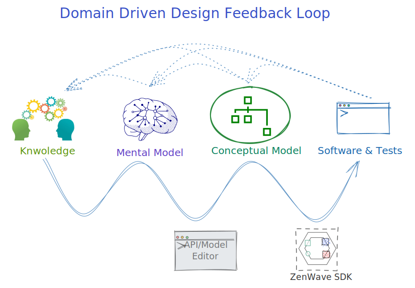

# ZenWave SDK

> 👉 ZenWave360 Helps You Create Software Easy to Understand

[](https://search.maven.org/artifact/io.github.zenwave360.zenwave-sdk/zenwave-sdk)
[](https://github.com/ZenWave360/zenwave-sdk/releases)

[](https://github.com/ZenWave360/zenwave-sdk/actions/workflows/build.yml)
[](https://github.com/ZenWave360/zenwave-sdk/actions/workflows/build.yml)
[](https://github.com/ZenWave360/zenwave-sdk/actions/workflows/build.yml)
[](https://github.com/ZenWave360/zenwave-sdk/blob/main/LICENSE)

## Domain Driven Design (DDD) and API-First for Event Driven Microservices

ZenWave SDK is a configurable and extensible code generator tool for **Domain Driven Design (DDD)** and **API-First** for **Event Driven Microservices** that can generate code from a mix of different models including:

- [JHipster Domain Language (JDL)](https://www.jhipster.tech/jdl/intro)
- [AsyncAPI](https://www.asyncapi.com/docs/getting-started/coming-from-openapi)
- [OpenAPI](https://swagger.io/specification/)

Using JHipster Domain Language as **Ubiquitous Language** for **Data on the Inside** and **API-First** specs like **AsyncAPI** and **OpenAPI** to describe Inter Process Communications (IPC) for **Data on the Outside**.


- **JHipster Domain Language (JDL) as Ubiquitous Language:** To describe your domain core domain model
- **API-First specs like AsyncAPI and OpenAPI:** to describe Inter Process Communications (IPC) between bounded contexts/microservices.
- **ZenWave SDK:** to generate (_a lot of_) infrastructure, functional and testing code from your models and APIs.

ZenWave SDK is designed to be easily extensible and adaptable to your project or your organization needs and likes. You can always [fork an existing, standard or custom plugin](https://github.com/ZenWave360/zenwave-sdk/#forking-an-standard-or-custom-plugin).

You can install the latest release using [jbang](https://www.jbang.dev) running the following command:

```shell
jbang alias add --fresh --name=zw release@zenwave360/zenwave-sdk
```

Please refer to [**ZenWave SDK**](https://github.com/ZenWave360/zenwave-sdk/) for more detailed installation options.

**Note:** Official plugins are designed to generate functional code and tests on top of existing projects. Creating a base project is out of scope, but you can always go to [start.spring.io](http://start.spring.io) or [start.jhipster.tech](https://start.jhipster.tech/), in case your company doesn't already have a project starter or archetype.

## Not (just) a Code Generator

ZenWave SDK is a **Modeling Tool** for Domain Driven Design and API-First in disguise of a _code generator_.

Its purpose is to produce successful software projects by dramatically shortening the feedback loop between the expert domain knowledge and working software and its tests.



In this way all team members: **Domain Experts**, **Product Owners**, **Software Architects**, **Developers** and **Testers** can provide early feedback based on an **Ubiquitous Language (JDL)** and the software and tests generated from that model.

## Why Domain Driven Design?

> "There are three types of developers implementing microservices. Those who use DDD, those who don't realise they do, and those who fail."

**DDD:** is about building software around a domain model that represents the problem we want to solve. Expressed by and Ubiquitous Language that is shared by all team members. It helps understand the problem before thinking of a solution. It connects Domain Experts with Technical Experts building a shared understanding of the problem and the solution.

**ZenWave360:** is about speeding up the feedback loop from idea -> model -> working software and tests.

<div style="text-align: center;" markdown="1">
  
</div>


## Table of Contents

<!-- TOC -->
- [ZenWave SDK](#zenwave-sdk)
  - [Domain Driven Design (DDD) and API-First for Event Driven Microservices](#domain-driven-design-ddd-and-api-first-for-event-driven-microservices)
  - [Not (just) a Code Generator](#not-just-a-code-generator)
  - [Why Domain Driven Design?](#why-domain-driven-design)
  - [Table of Contents](#table-of-contents)
  - [Generate complete Event Driven Microservices using DDD and API-First](#generate-complete-event-driven-microservices-using-ddd-and-api-first)
  - [What can we generate for you today?](#what-can-we-generate-for-you-today)
    - [Example: Generate a complete Backend Application from a JDL model](#example-generate-a-complete-backend-application-from-a-jdl-model)
    - [Describe your core business model using JDL:](#describe-your-core-business-model-using-jdl)
    - [Generate Backend Application](#generate-backend-application)
    - [Generate OpenAPI draft from JDL model](#generate-openapi-draft-from-jdl-model)
    - [Generate AsyncAPI definition from JDL model](#generate-asyncapi-definition-from-jdl-model)
    - [Configure ZenWave Maven Plugin for AsyncAPI generation](#configure-zenwave-maven-plugin-for-asyncapi-generation)
    - [Spring REST Controllers from OpenAPI](#spring-rest-controllers-from-openapi)
    - [Integration Test for your Controllers using Spring WebTestClient](#integration-test-for-your-controllers-using-spring-webtestclient)
    - [E2E and Contract Testing](#e2e-and-contract-testing)
      - [KarateDSL Ent-to-End tests for REST APIs (using sister project ZenWave KarateIDE)](#karatedsl-ent-to-end-tests-for-rest-apis-using-sister-project-zenwave-karateide)
      - [High Fidelity Stateful REST API Mocks (using sister project ZenWave ApiMock)](#high-fidelity-stateful-rest-api-mocks-using-sister-project-zenwave-apimock)
      - [AsyncAPI interfaces Mocks and Contract Tests (ToBeDefined)](#asyncapi-interfaces-mocks-and-contract-tests-tobedefined)
- [Refactoring a legacy monolith](#refactoring-a-legacy-monolith)
    - [Reverse engineering JDL from Java classes (JPA and MongoDB)](#reverse-engineering-jdl-from-java-classes-jpa-and-mongodb)
- [Adding functionality on top of an existent microservices architecture](#adding-functionality-on-top-of-an-existent-microservices-architecture)
    - [Reverse engineering JDL from Java classes (JPA and MongoDB)](#reverse-engineering-jdl-from-java-classes-jpa-and-mongodb-1)
    - [Reverse engineering JDL from OpenAPI definition schemas](#reverse-engineering-jdl-from-openapi-definition-schemas)
<!-- TOC -->

## Generate complete Event Driven Microservices using DDD and API-First

You can generate complete Event Driven Microservices using DDD and API-First

> 👉 Describe your Model → Generate Backend ⤳ Generate OpenAPI ⤳ Generate AsyncAPI → Generate API Implementations → Generate Tests and Contracts 👍

1. Start by describing your core domain model using JDL entities and relationships, annotations and comments.
2. Generate a complete Backend Application from your Domain Definition Model.
3. Generate a draft OpenAPI definition from the JDL model. Edit collaboratively this OpenAPI document and then generate some more functional code and tests from that definition.
4. Generate a draft AsyncAPI definition for consuming async request commands and publishing domain events. Now use zenwave maven plugin to generate strongly typed business interfaces implementing some Enterprise Integration Patterns like: transactional outbox, business dead letter queue...
5. Generate E2E, Integration tests and Consumer Contracts for the public APIs you just produced.


## What can we generate for you today?

Whether you are:

- [Designing a system from scratch](#designing-a-system-from-scratch-with-ddd-and-api-first),
- [Refactoring a legacy monolith](#refactoring-a-legacy-monolith) or just
- [Adding functionality on top of an existent microservices architecture](#adding-functionality-on-top-of-an-existent-microservices-archytecture)

...ZenWave SDK can... **generate a lot of code for you!!**


- [x] Standard Plugins
  - [x] JDL Backend Application (flexible hexagonal architecture)
    - [x] Domain Entities,
    - [x] Inbound
      - [x] Service Ports, DTOs, Mappers
      - [x] Implementation for CRUD operations
      - [x] Acceptance Tests: SpringData InMemory Repositories
    - [x] Outbound: SpringData Repositories, ElasticSearch... (for REST or Async see other plugins)
    - [x] Adapters:
      - [x] Spring MVC
      - [ ] ~~Spring WebFlux~~
    - [x] Flavors
      - [x] MongoDB
        - [x] Imperative
        - [ ] ~~Reactive~~
      - [x] JPA
        - [x] Imperative
        - [ ] ~~Reactive~~
    - [x] Unit/Integration Testing
      - [x] Edge Integration Testing: partial spring-boot context for outbound adapters (with testcontainers)
      - [x] Sociable Vertical Testing: manual dependency setup with in memory infrastructure _test-doubles_
      - [x] Vertical Integration Testing: full spring-boot context for inbound adapters (with testcontainers)
  - [x] JDL OpenAPI Controllers
  - [x] OpenAPI to Spring WebTestClient
  - [x] AsyncAPI Spring Cloud Streams3
    - [x] Consumer and Producer. Imperative and Reactive.
      - [x] Business Exceptions Dead Letter Queues Routing
    - [x] Producer with Transactional Outbox pattern
      - [x] For MongoDB
      - [x] For JDBC
    - [x] Enterprise Envelop Pattern
    - [x] Automatically fill headers at runtime from payload paths, tracing-id supplier...
  - [x] JDL to Specs
    - [x] JDL to OpenAPI
    - [x] JDL to AsyncAPI
      - [x] AsyncAPI schemas
      - [x] AVRO schemas
  - [x] API Testing
    - [x] KarateDSL
      - [x] OpenAPI to Karate E2E Tests (please use [KarateIDE VSCode Extension](https://github.com/ZenWave360/karate-ide) instead)
      - [x] OpenAPI to Karate/ApiMock Stateful Mocks (please use [KarateIDE VSCode Extension](https://github.com/ZenWave360/karate-ide) and [ZenWave ApiMock](https://github.com/ZenWave360/zenwave-apimock) instead)
    - [x] OpenAPI to Spring WebTestClient
    - [x] OpenAPI to REST-assured
    - [ ] ~~OpenAPI to Pact (_postponed sine die_)~~
  - [x] Reverser Engineering
    - [x] OpenAPI 2 JDL
    - [x] Java 2 JDL
      - [x] Spring Data MongoDB annotations
      - [x] JPA annotations

### Example: Generate a complete Backend Application from a JDL model

You can navigate the [complete example](https://github.com/ZenWave360/zenwave-examples/tree/main/examples/spring-boot-mongodb-elasticsearch-kafka-example) or use [this skeleton](https://github.com/ZenWave360/zenwave-examples/tree/main/skeletons/spring-boot-mongodb-elasticsearch-kafka-skeleton) to follow along these instructions.


### Describe your core business model using JDL:

<details markdown="1">
  <summary>orders-model.jdl (expand to see)</summary>

```jdl
/* Customers */
@aggregate
@search(elasticsearch)
@searchCriteria
entity Customer {
  username String required minlength(3) maxlength(250),
  password String required minlength(3) maxlength(250),
  email String required minlength(3) maxlength(250),
  firstName String required minlength(3) maxlength(250),
  lastName String required minlength(3) maxlength(250)
}


/* Orders */
enum OrderStatus { CONFIRMED, SHIPPED, DELIVERED }

@aggregate
@searchCriteria(CustomerOrderSearchCriteria)
entity CustomerOrder { // Order is a reserved word
  date Instant,
  status OrderStatus
  customer Customer
  orderedItems OrderedItem[]
  paymentDetails PaymentDetails[]
  shippingDetails ShippingDetails
}

@skip
entity CustomerOrderSearchCriteria {
  status OrderStatus
  dateFrom Instant
  dateTo Instant
}

@embedded
entity OrderedItem {
  catalogItemId Long,
  name String required minlength(3) maxlength(250),
  price BigDecimal required,
  quantity Integer
}

@embedded
entity PaymentDetails {
  creditCardNumber String
}

@embedded
entity ShippingDetails {
  address String
}

service Customer with CustomerUseCases
service CustomerOrder with CustomerOrderUseCases
```
</details>

Default backend generator supports the following @annotations:

- if any entity is annotated with @aggregate then the following table applies:

| **Annotation**                  | **Entity** | **@Persistence** | **Repository** | **Id** |
|:--------------------------------|------------|:-----------------|:---------------|:-------|
| **entity**                      | yes        | yes              |                | yes    |
| **@aggregate**                  | yes        | yes              | yes            | yes    |
| **@embedded**                   | yes        | yes              |                |        |
| **@vo**                         | yes        |                  |                |        |
| **@searchCriteria(entityName)** |            |                  |                |        |
| **@skip**                       | no         |                  |                |        |

**@searchCriteria(entityName)** is used to specify the entity name for the search criteria, if empty will take the same fields as the actual entity.
**@skip** entities used as search criteria should be marked with @skip


### Generate Backend Application

```shell
jbang zw -p io.zenwave360.sdk.plugins.BackendApplicationDefaultPlugin \
    specFile=src/main/resources/model/orders-model.jdl \
    basePackage=io.zenwave360.example \
    persistence=mongodb \
    style=imperative \
    targetFolder=.
```

<details markdown="1">
  <summary>generated files (expand to see)</summary>

```shell
# Domain models annotated for SpringData MongoDB
src/main/java/io/zenwave360/example/core/domain/Customer.java
src/main/java/io/zenwave360/example/core/domain/CustomerOrder.java
src/main/java/io/zenwave360/example/core/domain/OrderedItem.java
src/main/java/io/zenwave360/example/core/domain/OrderStatus.java
src/main/java/io/zenwave360/example/core/domain/PaymentDetails.java
src/main/java/io/zenwave360/example/core/domain/ShippingDetails.java

# Inbound Interfaces
src/main/java/io/zenwave360/example/core/inbound/CustomerOrderUseCases.java
src/main/java/io/zenwave360/example/core/inbound/CustomerUseCases.java
# Inbound DTOS
src/main/java/io/zenwave360/example/core/inbound/dtos/CustomerCriteria.java
src/main/java/io/zenwave360/example/core/inbound/dtos/CustomerInput.java
src/main/java/io/zenwave360/example/core/inbound/dtos/CustomerOrderInput.java
src/main/java/io/zenwave360/example/core/inbound/dtos/OrderedItemInput.java
src/main/java/io/zenwave360/example/core/inbound/dtos/PaymentDetailsInput.java
src/main/java/io/zenwave360/example/core/inbound/dtos/ShippingDetailsInput.java

# Outbound Interfaces for MongoDB
src/main/java/io/zenwave360/example/core/outbound/mongodb/CustomerOrderRepository.java
src/main/java/io/zenwave360/example/core/outbound/mongodb/CustomerRepository.java
src/main/java/io/zenwave360/example/core/outbound/mongodb/OrderedItemRepository.java
src/main/java/io/zenwave360/example/core/outbound/mongodb/PaymentDetailsRepository.java
src/main/java/io/zenwave360/example/core/outbound/mongodb/ShippingDetailsRepository.java

# Outbound Interfaces and annotated DTO for ElasticSearch
src/main/java/io/zenwave360/example/core/domain/search/CustomerDocument.java
src/main/java/io/zenwave360/example/core/outbound/search/CustomerSearchRepository.java

# Services/UseCases Implementation
src/main/java/io/zenwave360/example/core/implementation/CustomerOrderUseCasesImpl.java
src/main/java/io/zenwave360/example/core/implementation/CustomerUseCasesImpl.java
# Mapstruct Mappers used by Services/UseCases
src/main/java/io/zenwave360/example/core/implementation/mappers/CustomerMapper.java
src/main/java/io/zenwave360/example/core/implementation/mappers/CustomerOrderMapper.java
src/main/java/io/zenwave360/example/core/implementation/mappers/OrderedItemMapper.java
src/main/java/io/zenwave360/example/core/implementation/mappers/PaymentDetailsMapper.java
src/main/java/io/zenwave360/example/core/implementation/mappers/ShippingDetailsMapper.java

# Core UseCases acceptance tests
src/test/java/io/zenwave360/example/core/implementation/CustomerUseCasesTest.java
src/test/java/io/zenwave360/example/core/implementation/CustomerOrderUseCasesTest.java

# In Memory Mocks for infrastructure ports
src/test/java/io/zenwave360/example/infrastructure/mongodb/inmemory/InMemoryMongoRepository.java
src/test/java/io/zenwave360/example/infrastructure/mongodb/inmemory/PaymentDetailsRepositoryInMemory.java
src/test/java/io/zenwave360/example/infrastructure/mongodb/inmemory/CustomerRepositoryInMemory.java
src/test/java/io/zenwave360/example/infrastructure/mongodb/inmemory/OrderedItemRepositoryInMemory.java
src/test/java/io/zenwave360/example/infrastructure/mongodb/inmemory/CustomerOrderRepositoryInMemory.java
src/test/java/io/zenwave360/example/infrastructure/mongodb/inmemory/ShippingDetailsRepositoryInMemory.java
```

</details>

### Generate OpenAPI draft from JDL model

Generate a baseline OpenAPI definition from JDL entities:

- Component Schemas for entities, plain and paginated lists
- CRUD operations and Search for @aggregate entities

```shell
jbang zw -p io.zenwave360.sdk.plugins.ZDLToOpenAPIPlugin \
    specFile=src/main/resources/model/orders-model.jdl \
    targetFile=src/main/resources/model/openapi.yml
```

### Generate AsyncAPI definition from JDL model

Generate AsyncAPI definition from JDL entities:

- One channel for entity to publish domain events and listen for async request commands (optional)
- Messages and payloads for each entity Create/Update/Delete events (AVRO and AsyncAPI schema)

```shell
jbang zw -p io.zenwave360.sdk.plugins.JDLToAsyncAPIPlugin \
    includeCommands=true \
    specFile=src/main/resources/model/orders-model.jdl \
    targetFile=src/main/resources/model/asyncapi.yml
```

### Configure ZenWave Maven Plugin for AsyncAPI generation

<details open markdown="1">
  <summary>ZenWave SDK Maven Plugin (expand to see)</summary>

```xml
<plugin>
  <groupId>io.github.zenwave360.zenwave-sdk</groupId>
  <artifactId>zenwave-sdk-maven-plugin</artifactId>
  <version>${zenwave.version}</version>
  <plugin>
    <skip>false</skip>
    <addCompileSourceRoot>true</addCompileSourceRoot>
  </plugin>
  <executions>
    <!-- Individual Executions Go Here-->

  </executions>
  <dependencies>
    <dependency><!-- Plugins standard or custom go here -->
      <groupId>io.github.zenwave360.zenwave-sdk.plugins</groupId>
      <artifactId>asyncapi-spring-cloud-streams3</artifactId>
      <version>${zenwave.version}</version>
    </dependency>
    <dependency>
      <groupId>io.github.zenwave360.zenwave-sdk.plugins</groupId>
      <artifactId>asyncapi-jsonschema2pojo</artifactId>
      <version>${zenwave.version}</version>
    </dependency>
  </dependencies>
</plugin>
```
</details>

<details markdown="1">
  <summary>Producer Execution Config (expand to see)</summary>

```xml
    <!-- Generate PRODUCER -->
    <execution>
      <id>generate-asyncapi-producer</id>
      <phase>generate-sources</phase>
      <goals>
        <goal>generate</goal>
      </goals>
      <plugin>
        <generatorName>spring-cloud-streams3</generatorName>
        <inputSpec>${pom.basedir}/src/main/resources/model/asyncapi.yml</inputSpec>
        <configOptions>
          <role>provider</role>
          <style>imperative</style>
          <!--								<transactionalOutbox>mongodb</transactionalOutbox>-->
          <apiPackage>io.zenwave360.example.core.events.provider</apiPackage>
          <modelPackage>io.zenwave360.example.core.events.model</modelPackage>
        </configOptions>
      </plugin>
    </execution>
    <execution>
      <id>generate-asyncapi-producer-dtos</id>
      <phase>generate-sources</phase>
      <goals>
        <goal>generate</goal>
      </goals>
      <plugin>
        <generatorName>jsonschema2pojo</generatorName>
        <inputSpec>${pom.basedir}/src/main/resources/model/asyncapi.yml</inputSpec>
        <configOptions>
          <modelPackage>io.zenwave360.example.core.events.model</modelPackage>
<!--	  <jsonschema2pojo.includeTypeInfo>true</jsonschema2pojo.includeTypeInfo> -->
        </configOptions>
      </plugin>
    </execution>
```
</details>

<details markdown="1">
  <summary>Consumer Execution Config (expand to see)</summary>

```xml
    <!-- Generate CONSUMER -->
    <execution>
      <id>generate-asyncapi-consumer</id>
      <phase>generate-sources</phase>
      <goals>
        <goal>generate</goal>
      </goals>
      <plugin>
        <generatorName>spring-cloud-streams3</generatorName>
        <inputSpec>classpath:model/asyncapi.yml</inputSpec>
        <configOptions>
          <role>client</role>
          <style>imperative</style>
          <apiPackage>io.zenwave360.example.core.events.client</apiPackage>
          <modelPackage>io.zenwave360.example.core.events.model</modelPackage>
        </configOptions>
      </plugin>
    </execution>
```
</details>


### Spring REST Controllers from OpenAPI

You can generate SpringMVC controllers that implements the interfaces generated by the official OpenAPI generator.

```shell
jbang zw -p io.zenwave360.sdk.plugins.OpenAPIControllersPlugin \
    specFile=src/main/resources/model/openapi.yml \
    zdlFile=src/main/resources/model/orders-model.jdl \
    basePackage=io.zenwave360.example \
    openApiApiPackage=io.zenwave360.example.adapters.web \
    openApiModelPackage=io.zenwave360.example.adapters.web.model \
    openApiModelNameSuffix=DTO \
    targetFolder=.
````

<details markdown="1">
  <summary>generated files (expand to see)</summary>

```shell
# REST Controllers implementing OpenAPI generated interfaces
src/main/java/io/zenwave360/example/adapters/web/CustomerApiController.java
src/main/java/io/zenwave360/example/adapters/web/CustomerOrderApiController.java
# Mapstruct Mappers used by REST Controllers
src/main/java/io/zenwave360/example/adapters/web/mappers/CustomerDTOsMapper.java
src/main/java/io/zenwave360/example/adapters/web/mappers/CustomerOrderDTOsMapper.java
```
</details>

### Integration Test for your Controllers using Spring WebTestClient

Generates test for SpringMVC or Spring WebFlux using WebTestClient based on OpenAPI specification.

```shell
jbang zw -p io.zenwave360.sdk.plugins.SpringWebTestClientPlugin \
    specFile=src/main/resources/model/openapi.yml \
    zdlFile=src/main/resources/model/orders-model.jdl \
    targetFolder=src/test/java \
    controllersPackage=io.zenwave360.example.adapters.web \
    openApiApiPackage=io.zenwave360.example.adapters.web \
    openApiModelPackage=io.zenwave360.example.adapters.web.model \
    openApiModelNameSuffix=DTO \
    groupBy=SERVICE
```

### E2E and Contract Testing

#### KarateDSL Ent-to-End tests for REST APIs (using sister project ZenWave KarateIDE)

Use sister project [ZenWave KarateIDE](https://marketplace.visualstudio.com/items?itemName=KarateIDE.karate-ide)

[](https://www.youtube.com/watch?v=pYyRvly4cG8)

You can also find to deep dives into Contract Testing and API Mocking in this two medium articles:

- [Generating Karate Test Features from OpenAPI @medium](https://medium.com/@ivangsa/from-manual-to-contract-testing-with-karatedsl-and-karateide-i-5884f1732680#8311)
- [Generate Tests that simulates end-user Business Flows @medium](https://medium.com/@ivangsa/from-manual-to-contract-testing-with-karatedsl-and-karateide-i-5884f1732680#9b70)

#### High Fidelity Stateful REST API Mocks (using sister project ZenWave ApiMock)

See sister project [ZenWave ApiMock](https://github.com/ZenWave360/zenwave-apimock)

See also medium article: [High Fidelity Stateful Mocks (Consumer Contracts) with OpenAPI and KarateDSL @medium](https://medium.com/@ivangsa/high-fidelity-stateful-mocks-consumer-contracts-with-openapi-and-karatedsl-85a7f31cf84e)

#### AsyncAPI interfaces Mocks and Contract Tests (ToBeDefined)

_TODO_: Use Pact.io? Spring Cloud Contract? Roll your own?

# Refactoring a legacy monolith

### Reverse engineering JDL from Java classes (JPA and MongoDB)

If starting with legacy project, you can reverse engineer JDL from Java entity classes. JPA and MongoDB are supported.

It requires access to your project classpath, so you can just paste the following code on any test class or main method:

```java
String jdl = new JavaToJDLGenerator()
    .withPackageName("io.zenwave360.sdk.jpa2jdl")
    .withPersistenceType(JavaToJDLGenerator.PersistenceType.JPA)
    .generate();
System.out.println(jdl);
```

```java
String jdl = new JavaToJDLGenerator()
    .withPackageName("io.zenwave360.sdk.mongodb2jdl")
    .withPersistenceType(JavaToJDLGenerator.PersistenceType.MONGODB)
    .generate();
System.out.println(jdl);
```

# Adding functionality on top of an existent microservices architecture

### Reverse engineering JDL from Java classes (JPA and MongoDB)

When your domain java code evolves you may want to regenerate entities back from java code, see: [Reverse engineering JDL from Java classes (JPA and MongoDB)](#reverse-engineering-jdl-from-java-classes-jpa-and-mongodb)

### Reverse engineering JDL from OpenAPI definition schemas

Reverse engineer JDL entities from OpenAPI schemas:

```shell
jbang zw -p io.zenwave360.sdk.plugins.OpenAPIToJDLPlugin \
    specFile=openapi.yml targetFolder=target/out targetFile=entities.jdl
cat target/out/entities.jdl
```
