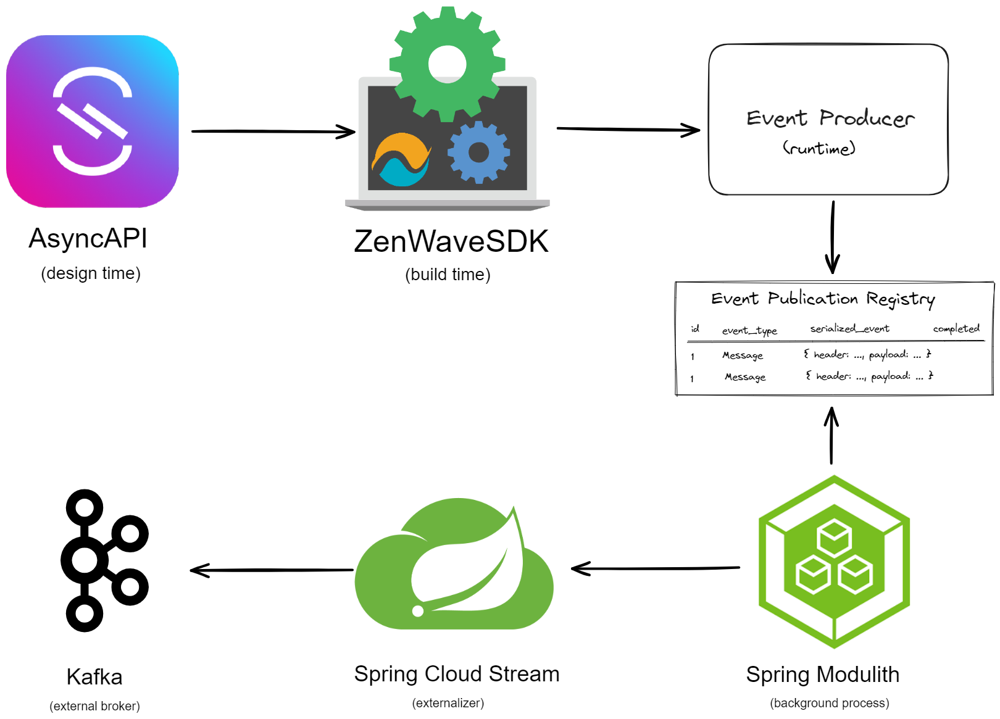

# AsyncAPI and Spring Cloud Stream 3
> 👉 ZenWave360 Helps You Create Software Easy to Understand

[](https://search.maven.org/artifact/io.zenwave360.sdk/zenwave-sdk)
[](https://github.com/ZenWave360/zenwave-sdk/blob/main/LICENSE)

> **Note**: Starting with version 2.0.0, the Maven `groupId` has changed to `io.zenwave360`. The code remains fully compatible.


<!-- TOC -->
* [AsyncAPI and Spring Cloud Stream 3](#asyncapi-and-spring-cloud-stream-3)
  * [Generating Consumer & Producer APIs](#generating-consumer--producer-apis)
  * [Maven Plugin Configuration (API-First)](#maven-plugin-configuration-api-first)
    * [Maven Plugin Base Configuration](#maven-plugin-base-configuration)
    * [Generate Model DTOs using `jsonschema2pojo`](#generate-model-dtos-using-jsonschema2pojo)
    * [Generate Spring Cloud Streams Provider Implementation with `spring-cloud-streams3`](#generate-spring-cloud-streams-provider-implementation-with-spring-cloud-streams3)
    * [Reverse Code Generation using `Client` role.](#reverse-code-generation-using-client-role)
  * [Getting Help](#getting-help)
    * [SpringCloudStreams3Plugin Options](#springcloudstreams3plugin-options)
  * [Advanced Features](#advanced-features)
  * [Transactional Outbox Pattern](#transactional-outbox-pattern)
    * [Populating Headers at Runtime Automatically](#populating-headers-at-runtime-automatically)
    * [InMemory Events Producer for Tests (Mocks)](#inmemory-events-producer-for-tests-mocks)
    * [Routing Business Exceptions to Dead Letter Queues with Configuration](#routing-business-exceptions-to-dead-letter-queues-with-configuration)
  * [Generating Consumer Adapters (Skeletons)](#generating-consumer-adapters-skeletons)
    * [Consumer Adapters API Tests](#consumer-adapters-api-tests)
    * [Options for Consumer Adapters](#options-for-consumer-adapters)
<!-- TOC -->

## Generating Consumer & Producer APIs

With ZenWave's `spring-cloud-streams3` and `jsonschema2pojo` generator plugins you can generate:
- Strongly typed **business interfaces**
- **Payload DTOs** and 
- **Header objects** from AsyncAPI definitions.

It uses Spring Cloud Streams as default implementation, so it can connect to many different brokers via provided binders.

And because everything is hidden behind interfaces we can encapsulate many Enterprise Integration Patterns:

- Transactional Outbox: with Spring Modulith, MongoDB ChangeStreams, Plain SQL or a custom solution
- Business DeadLetter Queues: allowing you to route different business Exceptions to different DeadLetter queues for non-retrayable errors.
- Enterprise Envelope: when your organization uses a common Envelope for messages, you can still express your AsyncAPI definition in terms of your business payload.

It supports AsyncAPI v2 (publish/subscribe) and AsyncAPI v3 (send/receive) styles. 

It also lets you reverse how the API is generated using the `client` role, so you don't need to define a new API definition just to consume an existing API.

## Maven Plugin Configuration (API-First)

Configure ZenWave Maven Plugin to generate code during your build process:

1. Add generator dependencies to `zenwave-sdk-maven-plugin`
2. Configure `<execution>` blocks for each generator (`jsonschema2pojo`, `spring-cloud-streams3`, etc)
3. Reference AsyncAPI files from dependencies using `classpath:` prefix
4. Set generator options using `<configOptions>` (see [SpringCloudStreams3Plugin Options](#springcloudstreams3plugin-options) )

### Maven Plugin Base Configuration

Use this as base configuration:

```xml
<plugin>
    <groupId>io.zenwave360.sdk</groupId>
    <artifactId>zenwave-sdk-maven-plugin</artifactId>
    <version>${zenwave.version}</version>
    <configuration>
        <addCompileSourceRoot>true</addCompileSourceRoot><!-- default is true -->
        <addTestCompileSourceRoot>true</addTestCompileSourceRoot><!-- default is true -->
    </configuration>
    <executions>
        <!-- Add executions for each generation here: -->
        <execution>
            <id>generate-asyncapi-xxx</id>
            <phase>generate-sources</phase>
            <goals>
                <goal>generate</goal>
            </goals>
            <configuration>
                <generatorName>spring-cloud-streams3</generatorName>
                <inputSpec>classpath:model/asyncapi.yml</inputSpec>
                <configOptions>
                    <!-- ... -->
                </configOptions>
            </configuration>
        </execution>
    </executions>
    
    <!-- add any sdk plugin (custom or standard) as dependency here -->
    <dependencies>
        <dependency><!-- optional dependency containing AsyncAPI definition files -->
            <groupId>com.example.apis</groupId>
            <artifactId>asyncapis</artifactId>
            <version>${apis.version}</version>
        </dependency>
        <dependency>
            <groupId>io.zenwave360.sdk.plugins</groupId>
            <artifactId>asyncapi-spring-cloud-streams3</artifactId>
            <version>${zenwave.version}</version>
        </dependency>
        <dependency>
            <groupId>io.zenwave360.sdk.plugins</groupId>
            <artifactId>asyncapi-jsonschema2pojo</artifactId>
            <version>${zenwave.version}</version>
        </dependency>
    </dependencies>
</plugin>
```
### Generate Model DTOs using `jsonschema2pojo`

Add this execution to generate model DTOs from AsyncAPI definitions:

```xml
<execution>
    <id>generate-asyncapi-producer-dtos</id>
    <phase>generate-sources</phase>
    <goals>
        <goal>generate</goal>
    </goals>
    <configuration>
        <generatorName>jsonschema2pojo</generatorName>
        <inputSpec>${pom.basedir}/src/main/resources/model/asyncapi.yml</inputSpec>
        <configOptions>
            <modelPackage>io.zenwave360.example.api.events.model</modelPackage>
        </configOptions>
    </configuration>
</execution>
```

### Generate Spring Cloud Streams Provider Implementation with `spring-cloud-streams3`

Add this execution to generate Spring Cloud Streams producer/consumer classes from AsyncAPI definitions:

```xml
<execution>
    <id>generate-asyncapi-producer</id>
    <phase>generate-sources</phase>
    <goals>
        <goal>generate</goal>
    </goals>
    <configuration>
        <generatorName>spring-cloud-streams3</generatorName>
        <inputSpec>classpath:model/asyncapi.yml</inputSpec>
        <configOptions>
            <role>provider</role><!-- use `client` to reverse code generation -->
            <transactionalOutbox>none</transactionalOutbox> <!-- `modulith` (preferred), `mongodb`, `jdbc` or `none` -->
            <modelPackage>io.zenwave360.example.api.events.model</modelPackage>
            <apiPackage>io.zenwave360.example.api.events</apiPackage>
            <!-- use <producerApiPackage></producerApiPackage> if you want to differentiate producer/consumer packages, it overrides apiPackage -->
            <!-- use <consumerApiPackage></consumerApiPackage> if you want to differentiate producer/consumer packages, it overrides apiPackage -->
        </configOptions>
    </configuration>
</execution>
```

### Reverse Code Generation using `Client` role.

If you want to generate the consumer side of an existing API, you can use the `client` role to reverse how the API is generated:

```xml
<execution>
    <id>generate-asyncapi-client-imperative</id>
    <phase>generate-sources</phase>
    <goals>
        <goal>generate</goal>
    </goals>
    <configuration>
        <generatorName>spring-cloud-streams3</generatorName>
        <inputSpec>${pom.basedir}/src/main/resources/model/asyncapi.yml</inputSpec>
        <configOptions>
            <role>client</role>
            <modelPackage>io.zenwave360.example.api.events.model</modelPackage>
            <apiPackage>io.zenwave360.example.api.events</apiPackage>
        </configOptions>
    </configuration>
</execution>
```


Because APIs mediated by a broker are inherently **reciprocal** it's difficult to establish the roles of client/server: what represents a `publish` operation from one side will be a `subscribe` operation seen from the other side. Also, a given service can act as a publisher and subscriber on the same API.

For these reasons, to avoid defining the same API operations multiple times from each perspective, we propose to define de API only once from the perspective of the provider of the functionality, which may be a producer, a consumer or both. 

Some definitions:

- SERVICE: An independent piece of software, typically a microservice, that provides a set of capabilities to other services.
- PROVIDER: The service that implements the functionality of the API. It may be accepting asynchronous command request or publishing business domain events.
- CLIENT/s: The service/s that makes use of the functionality of the API. It may be requesting asynchronous commands or subscribing to business domain events.
- PRODUCER: A service that writes a given message.
- CONSUMER: A service that reads a given message.


Use the table to understand which section of AsyncAPI (publish or subscribe) to use for each topic, and which role (provider or client) to use on the plugin configuration.

|                              | Events                | Commands                |
|------------------------------|-----------------------|-------------------------|
| Provider                     | Produces (publish)    | Consumes (subscribe)    |
| Client                       | Consumes (subscribe)  | Produces (publish)      |
| OperationId Suggested Prefix | **on**&lt;Event Name> | **do**&lt;Command Name> |

## Getting Help

```shell
jbang zw -p io.zenwave360.sdk.plugins.SpringCloudStreams3Plugin --help
```

### SpringCloudStreams3Plugin Options

| **Option**                        | **Description**                                                                                                                                                                                                            | **Type**                | **Default**          | **Values**                    |
|-----------------------------------|----------------------------------------------------------------------------------------------------------------------------------------------------------------------------------------------------------------------------|-------------------------|----------------------|-------------------------------|
| `apiFile`                         | API Specification File                                                                                                                                                                                                     | URI                     |                      |                               |
| `apiFiles`                        | API Spec files to parse (comma separated)                                                                                                                                                                                  | List                    |                      |                               |
| `role`                            | Project role: provider/client                                                                                                                                                                                              | AsyncapiRoleType        | provider             | provider, client              |
| `style`                           | Programming style                                                                                                                                                                                                          | ProgrammingStyle        | imperative           | imperative, reactive          |
| `modelPackage`                    | Java Models package name                                                                                                                                                                                                   | String                  |                      |                               |
| `producerApiPackage`              | Java API package name for outbound (producer) services. It can override apiPackage for producers.                                                                                                                          | String                  | {{apiPackage}}       |                               |
| `consumerApiPackage`              | Java API package name for inbound (consumer) services. It can override apiPackage for consumer.                                                                                                                            | String                  | {{apiPackage}}       |                               |
| `apiPackage`                      | Java API package name for producerApiPackage and consumerApiPackage if not specified.                                                                                                                                      | String                  |                      |                               |
| `transactionalOutbox`             | Transactional outbox type for message producers.                                                                                                                                                                           | TransactionalOutboxType | none                 | none, modulith, mongodb, jdbc |
| `bindingPrefix`                   | SC Streams Binding Name Prefix (used in @Component name)                                                                                                                                                                   | String                  |                      |                               |
| `bindingSuffix`                   | Spring-Boot binding suffix. It will be appended to the operation name kebab-cased. E.g. <operation-id>-in-0                                                                                                                | String                  | -0                   |                               |
| `generatedAnnotationClass`        | Annotation class to mark generated code (e.g. `org.springframework.aot.generate.Generated`). When retained at runtime, this prevents code coverage tools like Jacoco from including generated classes in coverage reports. | String                  |                      |                               |
| `targetFolder`                    | Target folder to generate code to. If left empty, it will print to stdout.                                                                                                                                                 | File                    |                      |                               |
| `modelNamePrefix`                 | Sets the prefix for model classes and enums                                                                                                                                                                                | String                  |                      |                               |
| `modelNameSuffix`                 | Sets the suffix for model classes and enums                                                                                                                                                                                | String                  |                      |                               |
| `runtimeHeadersProperty`          | AsyncAPI extension property name for runtime auto-configuration of headers.                                                                                                                                                | String                  | x-runtime-expression |                               |
| `includeApplicationEventListener` | Include ApplicationEvent listener for consuming messages within the modulith.                                                                                                                                              | boolean                 | false                |                               |
| `skipProducerImplementation`      | Generate only the producer interface and skip the implementation.                                                                                                                                                          | boolean                 | false                |                               |
| `exposeMessage`                   | Whether to expose underlying spring Message to consumers or not.                                                                                                                                                           | boolean                 | false                |                               |
| `useEnterpriseEnvelope`           | Include support for enterprise envelop wrapping/unwrapping.                                                                                                                                                                | boolean                 | false                |                               |
| `envelopeJavaTypeExtensionName`   | AsyncAPI Message extension name for the envelop java type for wrapping/unwrapping.                                                                                                                                         | String                  | x-envelope-java-type |                               |
| `methodAndMessageSeparator`       | To avoid method erasure conflicts, when exposeMessage or reactive style this character will be used as separator to append message payload type to method names in consumer interfaces.                                    | String                  | $                    |                               |
| `consumerPrefix`                  | SC Streams Binder class prefix                                                                                                                                                                                             | String                  |                      |                               |
| `consumerSuffix`                  | SC Streams Binder class suffix                                                                                                                                                                                             | String                  | Consumer             |                               |
| `consumerServicePrefix`           | Business/Service interface prefix                                                                                                                                                                                          | String                  | I                    |                               |
| `consumerServiceSuffix`           | Business/Service interface suffix                                                                                                                                                                                          | String                  | ConsumerService      |                               |
| `includeKafkaCommonHeaders`       | Include Kafka common headers 'kafka_messageKey' as x-runtime-header                                                                                                                                                        | boolean                 | false                |                               |
| `bindingTypes`                    | Binding names to include in code generation. Generates code for ALL bindings if left empty                                                                                                                                 | List                    |                      |                               |
| `operationIds`                    | Operation ids to include in code generation. Generates code for ALL if left empty                                                                                                                                          | List                    | []                   |                               |
| `excludeOperationIds`             | Operation ids to exclude in code generation. Skips code generation if is not included or is excluded.                                                                                                                      | List                    | []                   |                               |
| `formatter`                       | Code formatter implementation                                                                                                                                                                                              | Formatters              | palantir             | palantir, spring, google      |
| `skipFormatting`                  | Skip java sources output formatting                                                                                                                                                                                        | boolean                 | false                |                               |
| `haltOnFailFormatting`            | Halt on formatting errors                                                                                                                                                                                                  | boolean                 | true                 |                               |


## Advanced Features

### Transactional Outbox Pattern

ZenWave SDK supports sending messages transactionaly using the [Transactional Outbox Pattern](https://microservices.io/patterns/data/transactional-outbox.html).



See [Implementing a Transactional OutBox With AsyncAPI, SpringModulith and ZenWaveSDK](https://www.zenwave360.io/posts/TransactionalOutBoxWithAsyncAPIAndSpringModulith/) for complete details.

### Populating Headers at Runtime Automatically

ZenWave SDK provides `x-runtime-expression` for automatic header population at runtime. Values for this extension property are:

- `$message.payload#/<json pointer fragment>`: follows the same format as AsyncAPI [Correlation ID](https://www.asyncapi.com/docs/reference/specification/v2.5.0#correlationIdObject) object.
- `$message.payload#{ <SpEL expression> }`: will use the SpEL expression to populate the header value.
- `$supplierBeanName`: will use a bean named `supplierBeanName` (you can use any other name) of type `java.function.Supplier` configured in your Spring context.

```yaml
    CustomerEventMessage:
      name: CustomerEventMessage
      // [...] other properties omitted for brevity
      headers:
        type: object
        properties:
          kafka_messageKey:
            type: string
            description: This one will be populated automatically at runtime
            x-runtime-expression: $message.payload#/customer/id
          tracingId:
            type: string
            description: This one will be populated automatically at runtime
            x-runtime-expression: $supplierBeanName
          # CloudEvents Attributes: 
          # these examples showcase how you can use SpEL expressions to populate runtime headers
          ce-id:
            type: string
            description: Unique identifier for the event
            x-runtime-expression: $message.payload#{#this.id}
          ce-source:
            type: string
            description: URI identifying the context where event happened
            x-runtime-expression: $message.payload#{"CustomersService"}
          ce-specversion:
            type: string
            description: CloudEvents specification version
            x-runtime-expression: $message.payload#{"1.0"}
          ce-type:
            type: string
            description: Event type
            x-runtime-expression: $message.payload#{#this.getClass().getSimpleName()}
          ce-time:
            type: string
            description: Timestamp of when the event happened
            x-runtime-expression: $message.payload#{T(java.time.Instant).now().toString()}
```

You can also override the `runtimeHeadersProperty` extension property name (in the rare case you need to):

```xml
<configOption>
    <runtimeHeadersProperty>x-custom-runtime-expression</runtimeHeadersProperty><!-- you can also override this extension property name -->
</configOption>
```

And provide a bean of type `java.function.Supplier` in your Spring context:

```java
    @Bean("supplierBeanName")
    public Supplier supplierBeanName() {
        return () -> "some-value";
    }
```

### InMemory Events Producer for Tests (Mocks)

```java
// autogenerate in: target/generated-sources/zenwave/src/test/java/.../InMemoryCustomerOrderEventsProducer.java
public class InMemoryCustomerOrderEventsProducer implements ICustomerOrderEventsProducer {
    
    protected Map<String, List<Message>> capturedMessages = new HashMap<>();
    public Map<String, List<Message>> getCapturedMessages() {
        return capturedMessages;
    }
    // other details omitted for brevity
    
    /**
     * CustomerOrder Domain Events
     */
    public boolean onCustomerOrderEvent(CustomerOrderEventPayload payload, CustomerOrderEventPayloadHeaders headers) {
        log.debug("Capturing message to topic: {}", onCustomerOrderEventBindingName);
        Message message = MessageBuilder.createMessage(payload, new MessageHeaders(headers));
        return appendCapturedMessage(onCustomerOrderEventBindingName, message);
    }

}
```

```java
// autogenerated in: target/generated-sources/zenwave/src/test/java/.../ProducerInMemoryContext.java
public class ProducerInMemoryContext {

    public static final ProducerInMemoryContext INSTANCE = new ProducerInMemoryContext();


    private CustomerEventsProducerCaptor customerEventsProducerCaptor = new CustomerEventsProducerCaptor();

    public <T extends ICustomerEventsProducer> T customerEventsProducer() {
        return (T) customerEventsProducerCaptor;
    }
}
```

### Routing Business Exceptions to Dead Letter Queues with Configuration

When consuming Events you can route different business exceptions to different Dead Letter Queues bindings using the `dead-letter-queue-error-map`. 

This mechanism is useful when you know an exception is not retrayable, and you want to route it to a different DLQ.

When no matching exception is found in `dead-letter-queue-error-map`, the exception will propagate up the call stack, allowing standard retry and error handling mechanisms to take effect.

```yaml
# application.yml
spring:
  cloud:
    stream:
      bindings:
        do-create-customer-in-0:
          destination: customer.requests
          content-type: application/json
          dead-letter-queue-error-map: >
            {
              'jakarta.validation.ValidationException': 'do-create-customer-validation-error-out-0',
              'java.lang.Exception': 'do-create-customer-error-out-0'
            }
```

## Generating Consumer Adapters (Skeletons)

```shell
jbang zw -p io.zenwave360.sdk.plugins.SpringCloudStreams3AdaptersPlugin --help
```


```shell
jbang zw -p io.zenwave360.sdk.plugins.SpringCloudStreams3AdaptersPlugin \
    specFile=src/main/resources/model/asyncapi.yml \
    zdlFile=src/main/resources/model/orders-model.jdl \
    role=provider \
    style=imperative \
    basePackage=io.zenwave360.example \
    consumerApiPackage=io.zenwave360.example.adapters.events \
    modelPackage=io.zenwave360.example.core.domain.events \
    targetFolder=.
```

```java
@Component
public class DoCustomerRequestConsumerServiceAdapter implements IDoCustomerRequestConsumerService {

  private EventEntityMapper mapper;
  // TODO: private EntityUseCases service;

  @Autowired
  public void setEventEntityMapper(EventEntityMapper mapper) {
    this.mapper = mapper;
  }

  /** Customer Async Requests */
  public void doCustomerRequest(CustomerRequestPayload payload, CustomerRequestPayloadHeaders headers) {
    // TODO: service.doCustomerRequest(mapper.asEntity(payload));
  };
}
```

### Consumer Adapters API Tests

```java
// generated and editable in: src/test/java/.../adapters/events/DoCustomerRequestConsumerServiceIT.java
@SpringBootTest(webEnvironment = SpringBootTest.WebEnvironment.MOCK)
@org.springframework.transaction.annotation.Transactional
public class DoCustomerRequestConsumerServiceIT extends BaseConsumerTest {

  @Autowired public IDoCustomerRequestConsumerService consumerService;

  /** Test for doCustomerRequest: */
  @Test
  public void doCustomerRequestTest() {
    CustomerRequestPayload payload = new CustomerRequestPayload();
    payload.setCustomerId(null);
    payload.setRequestType(null);
    payload.setCustomer(null);

    CustomerRequestPayloadHeaders headers = new CustomerRequestPayloadHeaders();

    // invoke the method under test
    consumerService.doCustomerRequest(payload, headers);
    // perform your assertions here
  }
}
```


### Options for Consumer Adapters

| **Option**                     | **Description**                                                                                                                                                                         | **Type**                    | **Default**                                              | **Values**                        |
|--------------------------------|-----------------------------------------------------------------------------------------------------------------------------------------------------------------------------------------|-----------------------------|----------------------------------------------------------|-----------------------------------|
| `specFile`                     | API Specification File                                                                                                                                                                  | URI                         |                                                          |                                   |
| `specFiles`                    | ZDL files to parse                                                                                                                                                                      | String[]                    | []                                                       |                                   |
| `targetFolder`                 | Target folder to generate code to. If left empty, it will print to stdout.                                                                                                              | File                        |                                                          |                                   |
| `style`                        | Programming style                                                                                                                                                                       | ProgrammingStyle            | imperative                                               | imperative, reactive              |
| `role`                         | Project role: provider/client                                                                                                                                                           | AsyncapiRoleType            | provider                                                 | provider, client                  |
| `exposeMessage`                | Whether to expose underlying spring Message to consumers or not.                                                                                                                        | boolean                     | false                                                    |                                   |
| `apiId`                        | Unique identifier of each AsyncAPI that you consume as a client or provider. It will become the last package token for generated adapters                                               | String                      | commands                                                 |                                   |
| `basePackage`                  | Applications base package                                                                                                                                                               | String                      |                                                          |                                   |
| `adaptersPackage`              | The package to generate Async Inbound Adapters in                                                                                                                                       | String                      | {{basePackage}}.adapters.events.{{apiId}}                |                                   |
| `inboundDtosPackage`           | Package where your inbound dtos are                                                                                                                                                     | String                      | {{basePackage}}.core.inbound.dtos                        |                                   |
| `servicesPackage`              | Package where your domain services/usecases interfaces are                                                                                                                              | String                      | {{basePackage}}.core.inbound                             |                                   |
| `apiPackage`                   | Java API package name for producerApiPackage and consumerApiPackage if not specified.                                                                                                   | String                      |                                                          |                                   |
| `modelPackage`                 | Java Models package name                                                                                                                                                                | String                      |                                                          |                                   |
| `producerApiPackage`           | Java API package name for outbound (producer) services. It can override apiPackage for producers.                                                                                       | String                      | {{apiPackage}}                                           |                                   |
| `consumerApiPackage`           | Java API package name for inbound (consumer) services. It can override apiPackage for consumer.                                                                                         | String                      | {{apiPackage}}                                           |                                   |
| `bindingTypes`                 | Binding names to include in code generation. Generates code for ALL bindings if left empty                                                                                              | List                        |                                                          |                                   |
| `operationIds`                 | Operation ids to include in code generation. Generates code for ALL if left empty                                                                                                       | List                        | []                                                       |                                   |
| `runtimeHeadersProperty`       | AsyncAPI extension property name for runtime auto-configuration of headers.                                                                                                             | String                      | x-runtime-expression                                     |                                   |
| `continueOnZdlError`           | Continue even when ZDL contains fatal errors                                                                                                                                            | boolean                     | true                                                     |                                   |
| `inputDTOSuffix`               | Should use same value configured in BackendApplicationDefaultPlugin. Whether to use an input DTO for entities used as command parameter.                                                | String                      |                                                          |                                   |
| `baseTestClassName`            | BaseConsumerTest class name                                                                                                                                                             | String                      | BaseConsumerTest                                         |                                   |
| `baseTestClassPackage`         | BaseConsumerTest package                                                                                                                                                                | String                      | {{basePackage}}.adapters.events                          |                                   |
| `transactional`                | Annotate tests as @Transactional                                                                                                                                                        | boolean                     | true                                                     |                                   |
| `transactionalAnnotationClass` | @Transactional annotation class name                                                                                                                                                    | String                      | org.springframework.transaction.annotation.Transactional |                                   |
| `methodAndMessageSeparator`    | To avoid method erasure conflicts, when exposeMessage or reactive style this character will be used as separator to append message payload type to method names in consumer interfaces. | String                      | $                                                        |                                   |   
| `consumerPrefix`               | SC Streams Binder class prefix                                                                                                                                                          | String                      |                                                          |                                   |
| `consumerSuffix`               | SC Streams Binder class suffix                                                                                                                                                          | String                      | Consumer                                                 |                                   |
| `bindingPrefix`                | SC Streams Binding Name Prefix (used in @Component name)                                                                                                                                | String                      |                                                          |                                   |
| `servicePrefix`                | Business/Service interface prefix                                                                                                                                                       | String                      | I                                                        |                                   |
| `serviceSuffix`                | Business/Service interface suffix                                                                                                                                                       | String                      | ConsumerService                                          |                                   |
| `bindingSuffix`                | Spring-Boot binding suffix. It will be appended to the operation name kebab-cased. E.g. <operation-id>-in-0                                                                             | String                      | -0                                                       |                                   |
| `formatter`                    | Code formatter implementation                                                                                                                                                           | Formatters                  | spring                                                   | google, palantir, spring, eclipse |
| `skipFormatting`               | Skip java sources output formatting                                                                                                                                                     | boolean                     | false                                                    |                                   |
| `haltOnFailFormatting`         | Halt on formatting errors                                                                                                                                                               | boolean                     | true                                                     |                                   |
