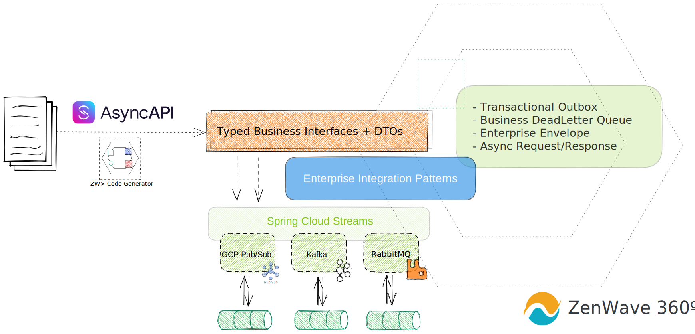

# AsyncAPI and Spring Cloud Stream 3
> 👉 ZenWave360 Helps You Create Software that's Easy to Understand

[](https://search.maven.org/artifact/io.github.zenwave360.zenwave-code-generator/zenwave-code-generator)
[](https://github.com/ZenWave360/zenwave-code-generator/blob/main/LICENSE)


With ZenWave's `spring-cloud-streams3` plugin you can generate strongly typed **business interfaces**, **payload DTOs** and **header objects** from AsyncAPI definitions.

It encapsulates SpringCloud Streams 3 API creating abstractions for many Enterprise Integration Patterns for Event Driven Architectures like: Transactional Outbox, Business DeadLetterQueue, Enterprise Envelop, Async Request/Response... behind business oriented interfaces.




Because APIs mediated by a broker are inherently **symmetrical** it's difficult to establish the roles of client/server: what represents a `publish` operation from one side will be a `subscribe` operation seen from the other side. Also, a given service can act as a publisher and subscriber on the same API.

For these reasons, to avoid defining the same API operations multiple times from each perspective, we propose to define de API only once from the perspective of the provider of the functionality, which may be a producer, a consumer or both. 

Some definitions:

- SERVICE: An independent piece of software, typically a microservice, that provides a set of capabilities to other services.
- PROVIDER: The service that implements the functionality of the API. It may be accepting asynchronous command request or publishing business domain events.
- CLIENT/s: The service/s that makes use of the functionality of the API. It may be requesting asynchronous commands or subscribing to business domain events.
- PRODUCER: A service that writes a given message.
- CONSUMER: A service that reads a given message.


Use the table to understand which section of AsyncAPI (publish or subscribe) to use for each topic, and which role (provider or client) to use on the plugin configuration.

|                              | Events                | Commands                |
|------------------------------|-----------------------|-------------------------|
| Provider                     | Produces (publish)    | Consumes (subscribe)    |
| Client                       | Consumes (subscribe)  | Produces (publish)      |
| OperationId Suggested Prefix | **on**&lt;Event Name> | **do**&lt;Command Name> |

## Enterprise Integration Patterns

Because access to the underlying broker is encapsulated behind the generated interfaces, it's possible to implement many Enterprise Integration Patterns (EIP) on top of them.

- Transactional Outbox: for mongodb and jdbc
- Business DeadLetter Queue
- Enterprise Envelope
- Async Request/Response (coming soon)

## Getting Help

```shell
jbang zw -p io.zenwave360.generator.plugins.SpringCloudStream3Plugin --help
```

## Options

| **Option**                  | **Description**                                                                                                                                                                         | **Type**                | **Default**     | **Values**           |
|-----------------------------|-----------------------------------------------------------------------------------------------------------------------------------------------------------------------------------------|-------------------------|-----------------|----------------------|
| `specFile`                  | API Specification File                                                                                                                                                                  | URI                     |                 |                      |
| `targetFolder`              | Target folder to generate code to. If left empty, it will print to stdout.                                                                                                              | File                    |                 |                      |
| `style`                     | Programming style                                                                                                                                                                       | ProgrammingStyle        | imperative      | imperative, reactive |
| `transactionalOutbox`       | Transactional outbox type for message producers.                                                                                                                                        | TransactionalOutboxType | none            | none, mongodb, jdbc  |
| `exposeMessage`             | Whether to expose underlying spring Message to consumers or not. Default: false                                                                                                         | boolean                 | false           |                      |
| `methodAndMessageSeparator` | To avoid method erasure conflicts, when exposeMessage or reactive style this character will be used as separator to append message payload type to method names in consumer interfaces. | String                  | $               |                      |
| `consumerPrefix`            | SC Streams Binder class prefix                                                                                                                                                          | String                  |                 |                      |
| `consumerSuffix`            | SC Streams Binder class suffix                                                                                                                                                          | String                  | Consumer        |                      |
| `servicePrefix`             | Business/Service interface prefix                                                                                                                                                       | String                  | I               |                      |
| `serviceSuffix`             | Business/Service interface suffix                                                                                                                                                       | String                  | ConsumerService |                      |
| `bindingSuffix`             | Spring-Boot binding suffix. It will be appended to the operation name kebab-cased. E.g. <operation-id>-in-0                                                                             | String                  | -0              |                      |
| `apiPackage`                | Java API package name                                                                                                                                                                   | String                  |                 |                      |
| `modelPackage`              | Java Models package name                                                                                                                                                                | String                  |                 |                      |
| `bindingTypes`              | Binding names to include in code generation. Generates code for ALL bindings if left empty                                                                                              | List                    |                 |                      |
| `role`                      | Project role: provider/client                                                                                                                                                           | AsyncapiRoleType        | provider        | provider, client     |
| `operationIds`              | Operation ids to include in code generation. Generates code for ALL if left empty                                                                                                       | List                    | []              |                      |
| `skipFormatting`            | Skip java sources output formatting                                                                                                                                                     | boolean                 | false           |                      |
| `haltOnFailFormatting`      | Halt on formatting errors                                                                                                                                                               | boolean                 | true            |                      |

## Maven Plugin Plugin (API-First)

You can use ZenWave Maven Plugin to generate code as part of your build process:

- Adding this generator jar as dependency to zenwave maven plugin.
- Passing plugin specific plugin as &lt;configOptions>.

```xml
<plugin>
    <groupId>io.github.zenwave360.zenwave-code-generator</groupId>
    <artifactId>zenwave-code-generator-mojo</artifactId>
    <version>${zenwave.version}</version>
    <plugin>
        <addCompileSourceRoot>true</addCompileSourceRoot><!-- default is true -->
    </plugin>
    <executions>
        <!-- Add executions for each generation here: -->
        <execution>
            <id>generate-asyncapi-xxx</id>
            <phase>generate-sources</phase>
            <goals>
                <goal>generate</goal>
            </goals>
            <plugin>
                <generatorName>spring-cloud-streams3</generatorName>
                <inputSpec>classpath:model/asyncapi.yml</inputSpec>
                <configOptions>
                    <!-- ... -->
                </configOptions>
            </plugin>
        </execution>
    </executions>
    
    <!-- add any generator plugin (custom or standard) as dependency here -->
    <dependencies>
        <dependency>
            <groupId>io.github.zenwave360.zenwave-code-generator.plugins</groupId>
            <artifactId>asyncapi-spring-cloud-streams3</artifactId>
            <version>${zenwave.version}</version>
        </dependency>
        <dependency>
            <groupId>io.github.zenwave360.zenwave-code-generator.plugins</groupId>
            <artifactId>asyncapi-jsonschema2pojo</artifactId>
            <version>${zenwave.version}</version>
        </dependency>
    </dependencies>
</plugin>
```

### Provider Imperative style without Transactional Outbox

```xml
<execution>
    <id>generate-asyncapi-producer</id>
    <phase>generate-sources</phase>
    <goals>
        <goal>generate</goal>
    </goals>
    <plugin>
        <generatorName>spring-cloud-streams3</generatorName>
        <inputSpec>classpath:model/asyncapi.yml</inputSpec>
        <configOptions>
            <role>provider</role>
            <style>imperative</style>
            <apiPackage>io.zenwave360.example.core.events.outbound.outbox.none</apiPackage>
            <modelPackage>io.zenwave360.example.core.events.model</modelPackage>
        </configOptions>
    </plugin>
</execution>
```

### Provider Imperative style without Mongodb Transactional Outbox

```xml
<execution>
    <id>generate-asyncapi-producer-outbox-mongodb</id>
    <phase>generate-sources</phase>
    <goals>
        <goal>generate</goal>
    </goals>
    <plugin>
        <generatorName>spring-cloud-streams3</generatorName>
        <inputSpec>classpath:model/asyncapi.yml</inputSpec>
        <configOptions>
            <role>provider</role>
            <style>imperative</style>
            <transactionalOutbox>mongodb</transactionalOutbox>
            <apiPackage>io.zenwave360.example.core.events.outbound.outbox.mongodb</apiPackage>
            <modelPackage>io.zenwave360.example.core.events.model</modelPackage>
        </configOptions>
    </plugin>
</execution>
```

### Provider Imperative style without JDBC Transactional Outbox

```xml
<execution>
    <id>generate-asyncapi-producer-outbox-jdbc</id>
    <phase>generate-sources</phase>
    <goals>
        <goal>generate</goal>
    </goals>
    <plugin>
        <generatorName>spring-cloud-streams3</generatorName>
        <inputSpec>classpath:model/asyncapi.yml</inputSpec>
        <configOptions>
            <role>provider</role>
            <style>imperative</style>
            <transactionalOutbox>jdbc</transactionalOutbox>
            <apiPackage>io.zenwave360.example.core.events.outbound.outbox.jdbc</apiPackage>
            <modelPackage>io.zenwave360.example.core.events.model</modelPackage>
        </configOptions>
    </plugin>
</execution>
```

### Model DTOs using `jsonschema2pojo` generator

```xml
<execution>
    <id>generate-asyncapi-producer-dtos</id>
    <phase>generate-sources</phase>
    <goals>
        <goal>generate</goal>
    </goals>
    <plugin>
        <generatorName>jsonschema2pojo</generatorName>
        <inputSpec>${pom.basedir}/src/main/resources/model/asyncapi.yml</inputSpec>
        <configOptions>
            <modelPackage>io.zenwave360.example.core.events.model</modelPackage>
        </configOptions>
    </plugin>
</execution>
```

### Provider with AVRO schema payloads.

```xml
<execution>
    <id>generate-asyncapi-producer-avro</id>
    <phase>generate-sources</phase>
    <goals>
        <goal>generate</goal>
    </goals>
    <plugin>
        <generatorName>spring-cloud-streams3</generatorName>
        <inputSpec>${pom.basedir}/src/main/resources/model/asyncapi-avro.yml</inputSpec>
        <configOptions>
            <role>provider</role>
            <style>imperative</style>
            <apiPackage>io.zenwave360.example.core.events.outbound.avro</apiPackage>
        </configOptions>
    </plugin>
</execution>

```

### Client Imperative style with Dead Letter Queue.

```xml
<execution>
    <id>generate-asyncapi-client-imperative</id>
    <phase>generate-sources</phase>
    <goals>
        <goal>generate</goal>
    </goals>
    <plugin>
        <generatorName>spring-cloud-streams3</generatorName>
        <inputSpec>${pom.basedir}/src/main/resources/model/asyncapi.yml</inputSpec>
        <configOptions>
            <role>client</role>
            <style>imperative</style>
            <apiPackage>io.zenwave360.example.core.events.inbound.imperative</apiPackage>
            <modelPackage>io.zenwave360.example.core.events.model</modelPackage>
        </configOptions>
    </plugin>
</execution>
```

### Client Reactive style with Dead Letter Queue.

```xml
<execution>
    <id>generate-asyncapi-client-reactive</id>
    <phase>generate-sources</phase>
    <goals>
        <goal>generate</goal>
    </goals>
    <plugin>
        <generatorName>spring-cloud-streams3</generatorName>
        <inputSpec>${pom.basedir}/src/main/resources/model/asyncapi.yml</inputSpec>
        <configOptions>
            <role>client</role>
            <style>reactive</style>
            <apiPackage>io.zenwave360.example.core.events.inbound.reactive</apiPackage>
            <modelPackage>io.zenwave360.example.core.events.model</modelPackage>
        </configOptions>
    </plugin>
</execution>
```
