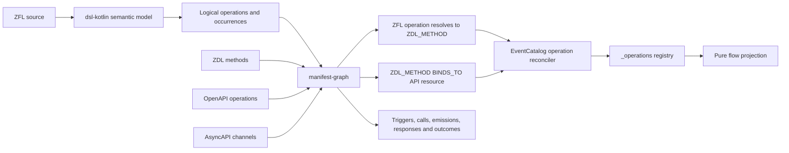

# Full-fidelity ZFL graph integration plan

## Purpose

Remove the remaining name-based compatibility fallback between ZFL operations, ZDL methods,
OpenAPI operations, AsyncAPI channels, and EventCatalog resources.

The final pipeline must resolve operation identity, occurrences, transport bindings, responses,
emissions, compensation, and terminal outcomes from the semantic model and architecture graph.
The EventCatalog generator must become a projection of that graph and must not infer bindings from
similar resource names.

The existing EventCatalog flow output shape remains valid:

- A genuine REST or AsyncAPI command binding renders as a native `message:` step.
- An unbound operation renders as a custom internal command node.
- Internal nodes retain their service URL and service-to-flow reverse link.
- ZFL operation Javadoc remains the step summary.

## Target architecture



The canonical identities are:

- `ZDL_METHOD`: canonical logical operation.
- `ZFL_OPERATION`: flow-local declaration of that operation.
- `ZFL_STEP` with `role=operation-occurrence`: one execution occurrence.
- `CHANNEL` or `API_OPERATION`: transport resource.
- `BINDS_TO`: typed relationship between a logical operation and a transport resource.

After migration, the EventCatalog generator must never infer these relationships from names.

---

## Phase 0 — Freeze the cross-layer semantic contract

Add a manifest-graph design document and KDoc before changing implementation.

### 0.1 Logical operation

A ZDL service method is the identity anchor:

```text
LogicalOperation
  graphNodeId       ZDL_METHOD id
  name
  intent            command | query
  owningServiceId
  source
  bindings[]
```

Rules:

- A ZFL `do` declaration represents an operation, not automatically an EventCatalog command.
- An operation is `exposed` only when it has an invocation binding.
- Trigger, emission, and response bindings do not expose the operation.
- An operation without invocation bindings remains internal.
- Internal operations appear in flows but do not receive EventCatalog pages unless
  `publishInternalOperations=true`.

### 0.2 Binding contract

Add `ArchitectureEdgeKind.BINDS_TO`.

Although graph attributes remain `Map<String, String>`, their schema must not be duplicated as raw
string literals across repositories. Publish the keys and allowed wire values from manifest-graph:

```kotlin
object ArchitectureBindingAttributes {
    const val ROLE = "role"
    const val TRANSPORT = "transport"
    const val MESSAGE_KIND = "messageKind"
    const val DIRECTION = "direction"
    const val OPERATION_ID = "operationId"
    const val METHOD = "method"
    const val PATH = "path"
    const val CHANNEL_KEY = "channelKey"
    const val ADDRESS = "address"
}

object ArchitectureBindingValues {
    const val ROLE_INVOCATION = "invocation"
    const val ROLE_TRIGGER = "trigger"
    const val ROLE_EMISSION = "emission"
    const val ROLE_RESPONSE = "response"
    const val TRANSPORT_OPENAPI = "openapi"
    const val TRANSPORT_ASYNCAPI = "asyncapi"
    const val KIND_COMMAND = "command"
    const val KIND_QUERY = "query"
    const val KIND_EVENT = "event"
    const val DIRECTION_SEND = "send"
    const val DIRECTION_RECEIVE = "receive"
}
```

Expose these as Java-friendly public constants and use them from manifest-graph and the SDK. Also
provide a typed `ArchitectureOperationBinding.from(edge)` decoder so consumers normally work with
enums instead of raw attribute strings. The raw map is the serialization representation, not the
application API.

Every `BINDS_TO` edge must have:

```yaml
role: invocation | trigger | emission | response
transport: openapi | asyncapi
messageKind: command | query | event
direction: send | receive
```

Additional transport-specific attributes:

```yaml
# OpenAPI
operationId: startOrderCheckout
method: POST
path: /orders

# AsyncAPI
channelKey: reserveStock
address: inventory.commands
operationId: receiveReserveStock
```

Rules:

- `role=invocation` means “this is how the owning service operation is invoked.”
- Only `role=invocation` can produce an EventCatalog command or query.
- An AsyncAPI command received by the owning service is an invocation.
- An AsyncAPI event received by the service is a trigger.
- An AsyncAPI event sent by the service is an emission.
- An outbound command sent to another service is not an invocation binding for the local operation.
- OpenAPI `GET` and `HEAD` operations are queries.
- OpenAPI `POST`, `PUT`, `PATCH`, and `DELETE` operations are commands.

### 0.3 Identity and version rules

- Logical operation ID: `ZDL_METHOD` graph ID.
- A modeled EventCatalog command or query ID is transport-independent:
  `catalogServiceId.<normalized-ZDL-method-name>`.
- An unmodeled AsyncAPI command with no `ZDL_METHOD` retains its channel-derived ID.
- Adding, removing, or combining REST and AsyncAPI bindings must not change the modeled operation's
  EventCatalog ID.
- Binding artifact version wins when explicitly declared.
- Otherwise, use the owning service's effective document version.

This deliberately changes the IDs of existing AsyncAPI commands that already resolve to ZDL
methods. It is an intentional one-time breaking migration to a stable logical-operation identity.
No redirects or aliases will be retained because this project is not preserving compatibility
outside the ZDL and ZFL parser contracts. The release notes must list the affected command URLs.

### 0.4 Occurrence contract

Retain operation definitions separately from execution occurrences:

```text
ZFL_OPERATION
  operation name
  system alias
  declared service
  declared service path
  source

ZFL_STEP role=operation-occurrence
  occurrenceKey
  operation
  triggers
  description
  actor
  timer
  source
```

Add these graph relationships:

- `OCCURRENCE_OF`: occurrence → `ZFL_OPERATION`
- `RESOLVES_TO`: `ZFL_OPERATION` → `ZDL_METHOD`
- `RESPONDS`
- `COMPENSATES`
- `RESULTS_IN`
- `ZFL_OUTCOME` node kind

Keep `INVOKES`, `EMITS`, and `TRIGGERS` for their literal meanings.

### Phase 0 gate

- The semantic contract is documented in manifest-graph.
- Attribute names and allowed values are fixed, published as constants, and covered by Java/Kotlin
  access tests before implementation.
- The three repositories agree on identity and version ownership.

---

## Phase 1 — Complete the dsl-kotlin semantic model

Repository: `C:\Users\ivangsa\workspace\zenwave\dsl-kotlin`

### 1.1 Retain ZflCommand and clarify its semantics

Do not rename `ZflCommand` to `ZflOperation`. Keep the existing semantic type and
`ZflFlow.commands`, but document them explicitly:

```kotlin
/**
 * A logical operation declared with ZFL `do` syntax.
 * It is not necessarily an externally transported EventCatalog command.
 */
data class ZflCommand(...)

data class ZflCommandOccurrence(...)
```

There are no deprecated aliases or parallel semantic APIs. Compatibility is retained only for ZDL
and ZFL parser syntax and parser data contracts.

### 1.2 Preserve occurrences in the listener

Update:

- `ZflListenerImpl.kt`
- `ZflListenerUtils.kt`
- `ZflModel.kt`

Keep the existing merged operation view, but add:

```yaml
actions:
  authorizePayment:
    # merged compatibility view
    occurrences:
      - occurrence: 0
        javadoc: ...
        triggers: [OrderCreated]
        options: ...
        steps: ...
        emissions: ...
        responses: ...
        location: ...
      - occurrence: 1
        javadoc: ...
        triggers: [PaymentRetried]
        options: ...
        steps: ...
        emissions: ...
        responses: ...
        location: ...
```

Do not merge occurrence-specific:

- Javadoc
- annotations
- trigger sets
- actor or timer options
- compensation
- call steps and handler options
- emissions and responses
- source locations

### 1.3 Define stable occurrence keys

Use deterministic keys:

- Policy occurrence: `operation@when[sorted-trigger-set]`
- Duplicate policy with the same operation and trigger set: append `#2`, `#3`, based on source
  order among identical keys.
- Standalone operation definition: `operation@definition`.
- Call-edge discriminator: `call:<step-index>:<target-operation>`.
- Handler-call discriminator: `handler:<call-index>:<outcome>:<target-operation>`.

Adding an unrelated policy must not renumber existing unique trigger-based occurrences.

Reordering otherwise identical duplicate occurrences can change their `#2`/`#3` suffixes. This is
accepted behavior because those occurrences contain no semantic discriminator beyond source order.

### 1.4 Expand the semantic types

Recommended model:

```kotlin
data class ZflCommand(
    val name: String,
    val description: String?,
    val system: String?,
    val service: String?,
    val servicePath: String?,
    val occurrences: List<ZflCommandOccurrence>,
    val sourceRef: SourceRef
)

data class ZflCommandOccurrence(
    val key: String,
    val index: Int,
    val description: String?,
    val triggers: List<String>,
    val compensates: String?,
    val actor: String?,
    val timer: String?,
    val options: Map<String, String?>,
    val steps: List<ZflActionStep>,
    val emissions: List<ZflEmission>,
    val responses: List<ZflResponse>,
    val sourceRef: SourceRef
)

data class ZflEmission(
    val eventName: String,
    val outcome: String?,
    val failure: Boolean
)

data class ZflResponse(
    val name: String,
    val outcome: String?,
    val options: Map<String, String?>
)
```

Also add:

- `ZflPolicy.compensates`
- real `ZflPolicy.description`
- `ZflStart.fields`
- `ZflEnd.description`
- `ZflFlow.options`
- populated `ZflSystem.services`

### 1.5 Fix source locations

Replace the current placeholder `sourceRefOf("<zfl>", 1, 1)` behavior with locations from
`ZflModel.locations`.

Every operation, occurrence, trigger, call, signal, service declaration, and outcome should have a
real source reference.

### 1.6 DSL validation

Add diagnostics for:

- unknown compensation target
- conflicting service declarations across occurrences of one operation
- conflicting operation bodies where merging would be unsafe
- handler without preceding call
- unknown called operation
- duplicate indistinguishable occurrence key
- response with multiple events
- declared but unreachable operation
- missing service declaration where one is required

### 1.7 DSL tests

Extend:

- `ZflListenerKotlinTest`
- `ZflSemanticAnalyzerTest`
- eventflow transformer tests
- JSON semantic snapshots

Required cases:

- `authorizePayment` triggered by two different events
- same operation and same trigger repeated twice
- occurrence-specific Javadoc
- compensation
- failure emission
- response outcome
- operation actor or timer
- real line and column
- multiple service steps
- retry cycle

### Phase 1 gate

- All dsl-kotlin targets build.
- Existing JSON consumers compile.
- Occurrences survive parse → semantic serialization without merging.
- `ZflCommand` KDoc and tests establish that it represents a logical operation, not necessarily a
  transported command.

---

## Phase 2 — Add an OpenAPI operation index to manifest-core

Repository: `C:\Users\ivangsa\workspace\zenwave\zenwave-manifest`

Primary file:

- `manifest-core/src/commonMain/kotlin/io/zenwave360/manifest/ManifestApiConsumptions.kt`

### 2.1 New model

```kotlin
enum class OpenApiOperationIntent { COMMAND, QUERY }

data class OpenApiOperation(
    val operationId: String,
    val method: String,
    val path: String,
    val intent: OpenApiOperationIntent,
    val summary: String?,
    val description: String?
)

class OpenApiOperationIndex(
    val operations: List<OpenApiOperation>,
    val version: String?,
    val diagnostics: List<ManifestDiagnostic>
)
```

Expose:

```kotlin
fun openApiIndex(artifact: ResolvedManifestArtifact): OpenApiOperationIndex?
```

### 2.2 Index every supported verb

Index:

- `GET`
- `HEAD`
- `POST`
- `PUT`
- `PATCH`
- `DELETE`

Do not classify `OPTIONS` or `TRACE` as logical commands.

Normalize paths only for comparison. For example, `/orders/{orderId}` and `/orders/{id}` are
equivalent parameterized paths. Retain the original path in node attributes.

### 2.3 OpenAPI tests

Cover:

- every supported verb
- missing `operationId`
- duplicate operation IDs
- path parameter-name normalization
- referenced documents
- version extraction
- malformed contract diagnostics

### Phase 2 gate

Every OpenAPI operation needed by ZDL binding resolution is available by exact method/path identity.

---

## Phase 3 — Enrich manifest-graph

Repository: `C:\Users\ivangsa\workspace\zenwave\zenwave-manifest`

Main files:

- `ArchitectureGraph.kt`
- `ArchitectureGraphBuilder.kt`
- `ZdlGraphArtifactAnalyzer.kt`
- `ZflGraphArtifactAnalyzer.kt`
- `ApiConsumptionGraphContributor.kt`
- `GraphAnalyzerSupport.kt`

### 3.1 Extend graph types

Add:

```kotlin
enum class ArchitectureNodeKind {
    // existing kinds
    ZFL_OPERATION,
    ZFL_OUTCOME
}

enum class ArchitectureEdgeKind {
    // existing kinds
    OCCURRENCE_OF,
    RESOLVES_TO,
    BINDS_TO,
    RESPONDS,
    COMPENSATES,
    RESULTS_IN
}
```

Add `description: String?` to `ArchitectureNode`.

Keep occurrence nodes as `ZFL_STEP` with:

```yaml
role: operation-occurrence
operation: authorizePayment
occurrenceKey: authorizePayment@when[OrderCreated]
occurrenceIndex: 0
```

Start nodes remain `ZFL_STEP` with `role=start`.

### 3.2 Generate first-class API nodes

Manifest-graph is the sole owner of graph ID construction. Extend the existing public
`ArchitectureGraphIds` API with semantic helpers and use them inside every analyzer:

```kotlin
ArchitectureGraphIds.channel(ownerRef, artifactId, channelKey)
ArchitectureGraphIds.apiOperation(ownerRef, artifactId, operationId)
ArchitectureGraphIds.zdlMethod(ownerRef, artifactId, serviceName, methodName)
```

These helpers must delegate to the existing percent-encoding implementation. Callers must not
concatenate artifact IDs, semantic paths, or encoded segments themselves.

For AsyncAPI:

- `CHANNEL` represents the EventCatalog message resource.
- `API_OPERATION` represents send or receive operations.
- Channel attributes include message kind, address, version, summary, and description.

For OpenAPI:

- Create one `API_OPERATION` per indexed operation.
- Attributes include operation ID, method, normalized path, original path, intent, and version.

Every candidate resource must therefore have an exact graph node ID.

### 3.3 Resolve ZDL methods to OpenAPI operations

For each ZDL method with REST evidence:

1. Resolve its referenced OpenAPI artifact.
2. Restrict the search set to only the OpenAPI artifacts referenced by that ZDL API declaration.
3. Match the exact HTTP method.
4. Match the normalized path.
5. Require exactly one result across that restricted artifact set.
6. Add `ZDL_METHOD —BINDS_TO→ API_OPERATION`.

Attributes:

```yaml
role: invocation
transport: openapi
messageKind: command | query
direction: receive
method: POST
path: /orders
operationId: startOrderCheckout
```

Never use the method name as the primary match.

OpenAPI forbids duplicate method/path pairs within one document. Therefore,
`ambiguous-openapi-operation-binding` specifically means that more than one explicitly referenced
OpenAPI artifact provides the same normalized method/path. It never authorizes a repository-wide
search, and it follows the same no-cross-repository rule as explicit ZFL `@zdl` resolution.

Diagnostics:

- `unresolved-openapi-operation-binding`
- `ambiguous-openapi-operation-binding`
- `conflicting-openapi-operation-binding`

### 3.4 Resolve ZDL methods to AsyncAPI resources

Use the existing classified `AsyncApiChannelIndex`.

| Channel evidence | Binding role |
|---|---|
| Command received by owning service | `invocation` |
| Event received by owning service | `trigger` |
| Event sent by owning service | `emission` |
| Explicit response channel | `response` |
| Command sent to another service | `emission`, not local invocation |

Create `ZDL_METHOD —BINDS_TO→ CHANNEL` with all mandatory binding attributes.

If a ZDL event is the declared mapping point:

```text
ZDL_METHOD —EMITS→ ZDL_EVENT —BINDS_TO(role=emission)→ CHANNEL
```

`operationBindings(methodId)` must include direct bindings and bindings reachable through emitted
ZDL events.

Diagnostics:

- `unresolved-asyncapi-channel-binding`
- `ambiguous-asyncapi-channel-binding`
- `unsupported-asyncapi-binding-direction`
- `conflicting-operation-intent`

### 3.5 Validate every BINDS_TO edge

After contributions are merged, validate that:

- mandatory attributes exist
- an OpenAPI target is `API_OPERATION`
- an AsyncAPI target is `CHANNEL`
- an invocation command has a valid receiving direction
- a query invocation is OpenAPI `GET` or `HEAD`
- the referenced target exists
- the edge source is a `ZDL_METHOD` or supported intermediary such as `ZDL_EVENT`

Invalid edges produce `invalid-binding-edge` and are excluded from graph query results.

All producers and consumers must reference `ArchitectureBindingAttributes`,
`ArchitectureBindingValues`, and the typed `ArchitectureOperationBinding` decoder. Validation is
the final data-integrity gate, not the first place a misspelled attribute can be discovered.

### 3.6 Harden ZFL system and service resolution

For each explicit `@zdl`:

1. Resolve the artifact reference.
2. Require exactly one artifact.
3. Verify the declared ZDL service exists in that artifact.
4. Verify every referenced operation exists in that service.
5. Add `RESOLVES_TO` only on exact success.

```text
ZFL_OPERATION —RESOLVES_TO→ ZDL_METHOD
```

Once an explicit `@zdl` resolves to an artifact, never search another repository for a same-named
service or method.

Diagnostics:

- `unresolved-zfl-zdl-reference`
- `ambiguous-zfl-zdl-reference`
- `unresolved-zfl-service`
- `unresolved-zfl-operation`
- `zfl-operation-missing-service`
- `zfl-service-missing-zdl`

For intentionally external systems without `@zdl`, do not treat them as unresolved internal
services.

### 3.7 Validate all service steps

Do not inspect only the first `ZflServiceStep`.

For each occurrence:

- validate every service switch
- associate subsequent calls with the active service
- record the resolved system and service on the corresponding edge
- diagnose a call whose target cannot be resolved within that active service

This is required for flows that orchestrate multiple systems inside one operation body.

### 3.8 Create operation and occurrence nodes

For each semantic operation:

```text
ZFL_FLOW —CONTAINS→ ZFL_OPERATION
ZFL_OPERATION —RESOLVES_TO→ ZDL_METHOD
ZFL_OPERATION —CONTAINS→ occurrence ZFL_STEP
occurrence —OCCURRENCE_OF→ ZFL_OPERATION
```

Attach flow semantics to occurrences:

```text
event/start —TRIGGERS→ occurrence
occurrence —INVOKES→ target ZFL_OPERATION
occurrence —EMITS→ ZFL_EVENT
occurrence —RESPONDS→ ZFL_EVENT
occurrence —COMPENSATES→ target ZFL_OPERATION
```

Call-edge IDs must include the source occurrence key and source step index.

No graph ID may depend on the iteration order of unrelated nodes or edges.

### 3.9 Model end outcomes

Create one node per declared terminal outcome:

```text
ZFL_FLOW —CONTAINS→ ZFL_OUTCOME
ZFL_EVENT —RESULTS_IN→ ZFL_OUTCOME
```

Attributes:

```yaml
outcome: completed
failure: false
```

Remove the encoded `endOutcomes="completed=A;failed=B"` string after all consumers migrate.

`ZflGraphAnalyzerTest.kt` currently asserts the encoded `endOutcomes` attribute. Keep that assertion
only while the SDK still reads the legacy attribute during the stacked-commit rollout. In the same
integration series, after the SDK switches to `ZFL_OUTCOME`/`RESULTS_IN`, remove the legacy
attribute and replace the test with structural outcome-node and outcome-edge assertions. This is a
temporary commit-order constraint, not a released compatibility promise.

### 3.10 Preserve failure and response semantics

- Set `EMITS.failure=true` for `@failure` emissions.
- Use `RESPONDS`, not `EMITS`, for synchronous responses.
- Preserve outcome, handler role, async flag, and signal options as flat edge attributes.
- Populate `ZFL_EVENT.isError` from failure emissions instead of hardcoding `false`.

### 3.11 Add graph query helpers

Add Java-friendly helpers:

```kotlin
fun resolvedMethod(zflOperationId: String): ArchitectureNode?
fun operationBindings(methodNodeId: String): List<ArchitectureEdge>
fun operationBindings(
    methodNodeId: String,
    role: String
): List<ArchitectureEdge>
fun operationOccurrences(zflOperationId: String): List<ArchitectureNode>
fun flowOutcomes(flowId: String): List<ArchitectureNode>
```

`operationBindings` must return only validated `BINDS_TO` edges.

### 3.12 Manifest-graph tests

Add a full matrix:

- REST GET query
- REST POST, PUT, PATCH, and DELETE command
- async command receive = invocation
- async command send ≠ invocation
- async event receive = trigger
- async event send = emission
- response binding
- REST and async invocation on one method
- conflicting query and command evidence
- wrong explicit `@zdl`
- ambiguous explicit `@zdl`
- missing service
- misspelled operation
- multiple service steps
- repeated occurrences
- retry cycle
- compensation
- response versus emission
- failure event
- terminal outcomes
- stable graph IDs across unrelated source insertion

### Phase 3 gate

The graph can answer without names:

> Which ZDL method does this ZFL operation represent, where does each occurrence execute, what
> triggered it, and which API resources genuinely invoke it?

Because adding `ZFL_OPERATION`, `ZFL_OUTCOME`, `BINDS_TO`, and the other enum members breaks
exhaustive Kotlin `when` expressions at compile time, the gate also requires builds of every known
workspace graph consumer, including:

- `zenwave-lsp`
- `ZenWaveDomainModelEditor`
- SDK graph/MCP integrations
- any eventflow or editor module importing `ArchitectureNodeKind` or `ArchitectureEdgeKind`

Use a workspace-wide search for those enum types to discover additional consumers before the graph
change is considered complete.

---

## Phase 4 — Cut the EventCatalog generator over to graph identity

Repository: `C:\Users\ivangsa\workspace\zenwave\zenwave-sdk`

### 4.1 Attach graph identities to extracted resources

Manifest-graph owns the ID algorithm; SDK processors compute IDs only by calling the public
`ArchitectureGraphIds` helpers added in Phase 3.2. The SDK must never reproduce the ID layout,
semantic path format, or percent-encoding rules.

The processors already know the resolved `ManifestArtifact` and the raw channel or operation key.
They must compute:

```java
String graphResourceNodeId = ArchitectureGraphIds.channel(
    artifact.getOwnerRef(), artifact.getArtifactId(), channelKey);

String graphResourceNodeId = ArchitectureGraphIds.apiOperation(
    artifact.getOwnerRef(), artifact.getArtifactId(), operationId);
```

If the actual Java-facing manifest artifact accessors differ, adapt the call site, not the ID
algorithm. The public helper remains the single implementation of graph resource identity.

Attach the result as internal metadata:

```yaml
_graphResourceNodeId: artifact/.../channel/...
_graphBindingTransport: asyncapi
```

or:

```yaml
_graphResourceNodeId: artifact/.../api_operation/...
_graphBindingTransport: openapi
```

These fields are internal generator metadata and must not render in MDX.

Add round-trip integration tests using the same AsyncAPI/OpenAPI fixture through both paths:

1. Build the architecture graph and obtain the `CHANNEL` or `API_OPERATION` node ID.
2. Run the corresponding SDK document processor.
3. Read `_graphResourceNodeId` from the extracted candidate.
4. Assert exact equality with the graph-produced ID.
5. Include owner refs, artifact IDs, channel keys, and operation IDs containing characters that
   require percent encoding.

Required tests:

- AsyncAPI channel graph ID equals AsyncAPI processor candidate ID.
- OpenAPI operation graph ID equals OpenAPI processor candidate ID.
- Both Kotlin and Java call the same public `ArchitectureGraphIds` helpers successfully.
- A graph ID change causes the round-trip tests to fail in the SDK rather than silently losing the
  binding.

### 4.2 Rewrite operation reconciliation

Update `EventCatalogOperationProcessor`:

1. Iterate `ZDL_METHOD` nodes for each manifest service.
2. Read validated `operationBindings(method.id)`.
3. Keep only `role=invocation`.
4. Resolve extracted resources using `_graphResourceNodeId`.
5. Merge compatible REST and AsyncAPI command bindings.
6. Reject command/query conflicts.
7. Populate `_operations` by ZDL method graph ID.

Registry entry:

```yaml
graphOperationId: artifact/.../zdl_method/...
name: authorizePayment
intent: command
visibility: internal | exposed | conflict
bindings:
  - graphResourceNodeId: ...
    transport: asyncapi
    role: invocation
    resourceId: payments....authorize-payment-command
    resourceVersion: 0.1.0
resourceId: payments....authorize-payment-command
resourceVersion: 0.1.0
resourceType: command
```

The name lookup may remain as a convenience index, but not as identity or binding evidence.

The resource ID stored in `resourceId` follows Phase 0.3's transport-independent rule. The binding
entries still retain their channel/operation node IDs, artifact versions, and transport metadata.

### 4.3 Remove compatibility matching

Delete or make unreachable:

- canonical-name comparison
- suffix stripping
- removal of `command`, `query`, or `request` suffixes
- cross-type priority matching
- `[zfl-name-fallback-match]` warnings
- first-matching-resource selection

Do not add `allowLegacyNameBindingFallback` or any equivalent feature flag. Dependencies are
upgraded before the generator cutover, and mixed versions are not a supported runtime state. If a
stacked integration branch temporarily needs the old implementation, keep it in an earlier commit;
do not ship dead compatibility code in the final generator.

### 4.4 Make flow projection graph-only

Update `EventCatalogZflProcessor` to:

- iterate graph occurrences rather than reconstructing them from incoming edges
- resolve service through `occurrence → OCCURRENCE_OF → ZFL_OPERATION → RESOLVES_TO → ZDL_METHOD
  → owningService`
- resolve EventCatalog pointers through `_operations[graphOperationId]`
- use graph occurrence IDs for flow step IDs
- use call-edge IDs for call-site step IDs
- read descriptions directly from occurrence nodes
- read outcomes through `RESULTS_IN`
- distinguish `RESPONDS` from `EMITS`
- render `COMPENSATES` explicitly
- remove the unique-service-name fallback
- remove raw ZFL reparsing for Javadoc once graph descriptions are available

The output remains:

- Native `message:` for genuine commands.
- Custom internal command node for unbound operations.
- Service URL and reverse service-to-flow link retained.
- No trigger or binding objects placed in custom properties.

### 4.5 Generator diagnostics

Surface graph diagnostics consistently and prevent misleading pages:

- Invalid or unresolved binding: internal node, no native command link.
- Conflicting intent: diagnostic, no command or query page.
- Broken explicit `@zdl`: unresolved styling, not external styling.
- Wrong version or resource pointer: `unresolved-catalog-resource-pointer`.

### Phase 4 gate

For the Arcadia flow:

- `reserveStock` resolves to its native command using graph IDs.
- `authorizePayment` remains an internal custom operation if it has no invocation binding.
- No `[zfl-name-fallback-match]` log is emitted.
- No generator code compares names to decide operation bindings.

---

## Phase 5 — Breaking dependency rollout

### 5.1 Commit order

1. `dsl-kotlin`: enrich `ZflCommand` with occurrence semantics.
2. `zenwave-manifest/manifest-core`: OpenAPI index.
3. `zenwave-manifest/manifest-graph`: typed bindings, occurrences, outcomes, and strict resolution.
4. Publish new dsl-kotlin artifacts.
5. Update zenwave-manifest to the new dsl-kotlin version.
6. Publish manifest-core and manifest-graph.
7. Update `zenwave-sdk`'s `manifest-core.version`.
8. Cut the generator over to graph-only reconciliation.
9. Switch the SDK from the encoded `endOutcomes` attribute to `ZFL_OUTCOME`/`RESULTS_IN`, remove
   the encoded attribute, and flip `ZflGraphAnalyzerTest` to structural assertions.
10. Remove the name-based fallback implementation and warnings.
11. Update Arcadia fixtures or retain deliberate errors as diagnostic tests.

### 5.2 Compatibility policy

Compatibility is retained only for the ZDL and ZFL parser syntax and parser data contracts. There
are no compatibility aliases for semantic types, graph enums, graph attributes, EventCatalog IDs,
or generator matching behavior.

During the stacked-commit integration sequence:

- The encoded flow outcome attribute may exist between steps 3 and 8 only so the repository remains
  testable at each intermediate commit.
- Step 9 removes it before publication and changes `ZflGraphAnalyzerTest` in the same commit.
- The old name fallback may exist in the pre-cutover SDK commit, but it is deleted at step 10.
- No compatibility flag, alias, redirect, or deprecated semantic API is added.

Final released state:

- Graph-based resolution is mandatory.
- Legacy name fallback is absent.
- Old outcome encoding is absent.
- `ZflCommand` remains the semantic class and is documented as a logical operation.
- Modeled command/query IDs use the transport-independent logical-operation rule.
- The one-time AsyncAPI command ID migration is documented as breaking.

### 5.3 Isolated build sequence

On Windows:

```powershell
# dsl-kotlin
.\gradlew.bat clean build publishToMavenLocal `
  -Dmaven.repo.local=C:/Users/ivangsa/.codex/maven/repository

# zenwave-manifest
.\gradlew.bat clean build publishToMavenLocal `
  -Dmaven.repo.local=C:/Users/ivangsa/.codex/maven/repository

# event-catalog-generator
& 'C:\Users\ivangsa\.sdkman\candidates\maven\current\bin\mvn.cmd' `
  --batch-mode --no-transfer-progress `
  -s 'C:\Users\ivangsa\.codex\maven\settings.xml' test
```

Also run:

- dsl-kotlin Node/JS tests
- `zenwave-lsp` build and tests
- `ZenWaveDomainModelEditor` build and tests
- SDK graph/MCP integration tests
- every additional workspace project found to import `ArchitectureNodeKind` or
  `ArchitectureEdgeKind`

These builds are mandatory because new graph enum members break exhaustive Kotlin `when`
expressions at compile time.

---

## Phase 6 — End-to-end acceptance matrix

| Scenario | Required result |
|---|---|
| Internal ZDL operation | Flow node present; no EC page by default |
| REST POST operation | Native EC command |
| REST GET operation | Native EC query |
| Async command received | Native EC command |
| Async command sent elsewhere | Not treated as local invocation |
| Event-triggered operation | Event → operation; no invented command |
| REST + async command | One logical command with both bindings |
| Query + command conflict | Diagnostic; no resource page |
| Same operation, two triggers | Two stable occurrence nodes |
| Retry cycle | Stable cycle without duplicated synthetic IDs |
| Broken explicit `@zdl` | Diagnostic; no cross-repository fallback |
| Misspelled operation | `unresolved-zfl-operation` |
| Multiple service steps | Each resolved against its active service |
| Response | `RESPONDS`, not `EMITS` |
| Failure event | Failure metadata and styling |
| Compensation | Explicit compensation edge |
| End outcome | `ZFL_OUTCOME` reached through `RESULTS_IN` |
| Service version mismatch | Pointer diagnostic |
| Operation Javadoc | Occurrence summary without reparsing raw ZFL |
| Native command flow step | Exact ID and version click-through |
| Internal operation flow step | Current custom blue node and service URL |

## Definition of done

The boundary is fully removed only when all of these are true:

- `ZFL_OPERATION → RESOLVES_TO → ZDL_METHOD` is present for every resolved operation.
- Every API relationship is represented by a validated `BINDS_TO` role.
- Binding attribute producers and consumers use manifest-graph's published constants and typed
  decoder.
- Repeated ZFL operation occurrences have stable graph identities.
- Responses, failures, compensation, and terminal outcomes are graph-native.
- The generator resolves resources exclusively by graph node identity.
- `EventCatalogOperationProcessor` contains no name-based binding algorithm.
- No legacy-name fallback option exists.
- AsyncAPI and OpenAPI graph-resource ID round-trip tests pass across the Kotlin/Java boundary.
- Arcadia generates the same intended native and custom node shapes.
- Arcadia's incorrect declarations produce diagnostics instead of being masked.
- The complete dsl-kotlin, zenwave-manifest, SDK, and Arcadia integration suites pass.
- A strict integration run produces zero `zfl-name-fallback-match` warnings.

## Final deliverables

1. Updated `ZflCommand` semantic model with operation occurrences.
2. OpenAPI operation index in manifest-core.
3. Typed operation bindings and occurrence/outcome graph support in manifest-graph.
4. Strict service and operation resolution diagnostics.
5. Graph-identity-based EventCatalog reconciliation.
6. Graph-only ZFL flow projection.
7. Unit, graph, generator, and Arcadia integration coverage.
8. Removal of the name-based compatibility fallback.
9. Public graph ID helpers plus AsyncAPI/OpenAPI round-trip identity tests.
10. Public binding attribute constants and a typed binding decoder used by the SDK.
