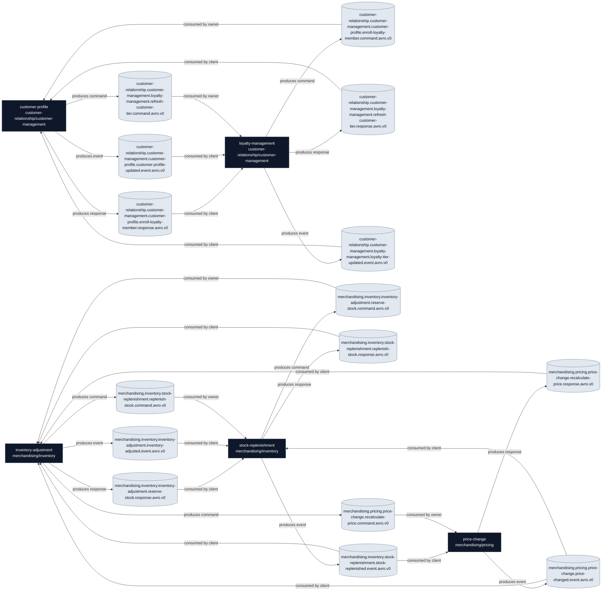

# Event Catalog Playground

This diagram proposes topic relationships from the folder structure `<domain>/<subdomain>/<service>/asyncapi.yml` using the convention:

`<domain>.<subdomain>.<service>.<event_name>.<message_type>.<content_type>.<version>`

## Topic Ownership

| Service | Topic | Type | Owner | Producer | Consumer | Clients |
| --- | --- | --- | --- | --- | --- | --- |
| `customer-profile` | `customer-relationship.customer-management.customer-profile.enroll-loyalty-member.command.avro.v0` | `command` | `customer-profile` | `loyalty-management` | `customer-profile` | `loyalty-management` |
| `customer-profile` | `customer-relationship.customer-management.customer-profile.enroll-loyalty-member.response.avro.v0` | `response` | `customer-profile` | `customer-profile` | `loyalty-management` | `loyalty-management` |
| `customer-profile` | `customer-relationship.customer-management.customer-profile.customer-profile-updated.event.avro.v0` | `event` | `customer-profile` | `customer-profile` | `loyalty-management` | `loyalty-management` |
| `loyalty-management` | `customer-relationship.customer-management.loyalty-management.refresh-customer-tier.command.avro.v0` | `command` | `loyalty-management` | `customer-profile` | `loyalty-management` | `customer-profile` |
| `loyalty-management` | `customer-relationship.customer-management.loyalty-management.refresh-customer-tier.response.avro.v0` | `response` | `loyalty-management` | `loyalty-management` | `customer-profile` | `customer-profile` |
| `loyalty-management` | `customer-relationship.customer-management.loyalty-management.loyalty-tier-updated.event.avro.v0` | `event` | `loyalty-management` | `loyalty-management` | `customer-profile` | `customer-profile` |
| `inventory-adjustment` | `merchandising.inventory.inventory-adjustment.reserve-stock.command.avro.v0` | `command` | `inventory-adjustment` | `stock-replenishment` | `inventory-adjustment` | `stock-replenishment` |
| `inventory-adjustment` | `merchandising.inventory.inventory-adjustment.reserve-stock.response.avro.v0` | `response` | `inventory-adjustment` | `inventory-adjustment` | `stock-replenishment` | `stock-replenishment` |
| `inventory-adjustment` | `merchandising.inventory.inventory-adjustment.inventory-adjusted.event.avro.v0` | `event` | `inventory-adjustment` | `inventory-adjustment` | `stock-replenishment` | `stock-replenishment` |
| `stock-replenishment` | `merchandising.inventory.stock-replenishment.replenish-stock.command.avro.v0` | `command` | `stock-replenishment` | `inventory-adjustment` | `stock-replenishment` | `inventory-adjustment` |
| `stock-replenishment` | `merchandising.inventory.stock-replenishment.replenish-stock.response.avro.v0` | `response` | `stock-replenishment` | `stock-replenishment` | `inventory-adjustment` | `inventory-adjustment` |
| `stock-replenishment` | `merchandising.inventory.stock-replenishment.stock-replenished.event.avro.v0` | `event` | `stock-replenishment` | `stock-replenishment` | `inventory-adjustment`, `price-change` | `inventory-adjustment`, `price-change` |
| `price-change` | `merchandising.pricing.price-change.recalculate-price.command.avro.v0` | `command` | `price-change` | `inventory-adjustment` | `price-change` | `inventory-adjustment` |
| `price-change` | `merchandising.pricing.price-change.recalculate-price.response.avro.v0` | `response` | `price-change` | `price-change` | `inventory-adjustment` | `inventory-adjustment` |
| `price-change` | `merchandising.pricing.price-change.price-changed.event.avro.v0` | `event` | `price-change` | `price-change` | `inventory-adjustment`, `stock-replenishment` | `inventory-adjustment`, `stock-replenishment` |

## Assumptions

- The first three path segments map directly to `<area>.<domain>.<service>`.
- For `command` and `response`, the owner is the service implementing the functionality.
- For `command`, the client is the requesting service that produces the command.
- For `response`, the owner produces the response and the client consumes it.
- For `event`, the owner is the publishing service and the clients are the subscribers.
- `avro` and `v0` are used consistently here as a baseline proposal.
